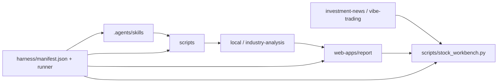

# 架构说明

本仓库按“能力清单 + 可审计归档 + 本地工作台 + harness 验证”组织，目标是让每个研究能力都能独立演进，同时保持统一入口和统一质量门禁。

## 分层

| 层级 | 目录 | 职责 |
| --- | --- | --- |
| 能力层 | `.agents/skills/` | 存放 skill 方法论、脚本、参考资料和模板。自研 skill 与开源 skill 都必须保留来源边界。 |
| 公共工具层 | `scripts/` | 跨 skill 复用的数据适配、工作台、harness CLI。不得沉淀某个单一 skill 的私有业务逻辑。 |
| 归档层 | `local/`、`industry-analysis/` | 保存日报、复盘、回测、阈值扫描和产业链报告。归档内容要求可追溯。 |
| Web 应用层 | `web-apps/` | 放可交互应用。外部 web 应用用 submodule 依赖，本仓库只保留集成边界。 |
| Harness 层 | `harness/` | 描述能力清单，运行结构检查、单测、完整检查和 web 健康检查。 |
| 文档层 | `README.md`、`docs/` | 面向使用者和开发者的入口、规范和操作指南。 |

## 服务集成

`scripts/stock_workbench.py` 是本地统一入口。它负责先重建可恢复的报告数据，再启动本仓库自研页面和外部 web 应用依赖：

| 服务 | 端口 | 健康口径 |
| --- | --- | --- |
| 统一工作台 | `8788` | `GET /api/health` 汇总依赖服务健康状态 |
| 交互报告 | `8765` | `GET /report/` 返回 2xx/3xx |
| 投资资讯看板 | `8793` | `GET /index.html` 返回 2xx/3xx |
| Vibe-Trading Wiki | `8088` | `GET /home/` 返回 2xx/3xx |
| Vibe-Trading 后端 | `8899` | `GET /health` 返回 2xx/3xx |
| Vibe-Trading 前端 | `4173` | `GET /` 返回 2xx/3xx，API 由前端代理到 `8899` |

工作台可以前台运行，也可以用 `--daemon`/`--stop` 托管到后台；后台日志和 pid 写入 `tmp/workbench/`，不入库。

外部应用保持 submodule 边界；主仓库只维护启动、健康检查、文档和测试入口，不直接改外部源码。Vibe-Trading 的 LLM provider 配置属于本机运行配置，放在 `web-apps/vibe-trading/agent/.env`，不入库。

## 关键约束

- `tmp/` 只放运行产物、临时报告和 harness 输出，不入库。
- skill 脚本如果会产生文件，默认输出到 `tmp/` 或明确的归档目录。
- `web-apps/report/data.js` 是可重建静态数据，只有在刻意同步报告快照时才提交。
- 外部仓库能力不要直接改源码；优先通过 submodule、manifest、适配脚本或文档约束集成。
- 新增能力必须能被 `harness/manifest.json` 描述，并至少有一个 smoke 级检查覆盖路径或入口编译。

## 运行关系

