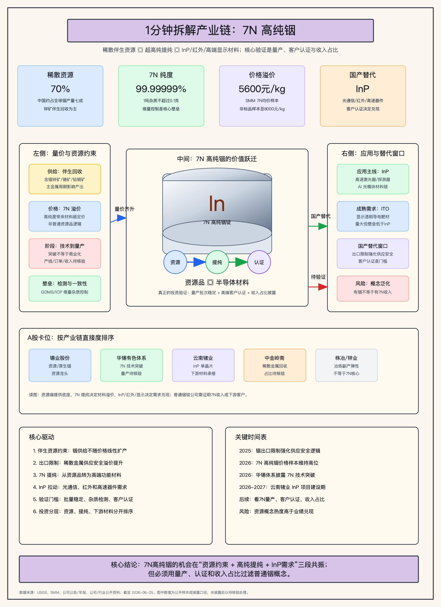

# 7N高纯铟上下游产业链与A股公司分析报告

> 分析日期：2026-06-25  
> 研究范围：中国及全球稀散金属铟产业链；A股映射覆盖资源、冶炼回收、7N高纯提纯、InP下游材料和相关待验证公司。  
> 分析口径：7N高纯铟指纯度99.99999%的超高纯铟，重点分析其从资源品向半导体/光电功能材料跃迁的产业链价值。

## 0. 核心结论

1. 7N高纯铟不是普通铟锭逻辑，而是“稀散资源约束 + 超高纯提纯 + III-V族化合物半导体需求”的高端材料逻辑，核心价值来自把资源品升级为半导体/光电功能材料。
2. 当前产业链最稀缺的不是“有铟资源”本身，而是把铟稳定提纯到7N、控制痕量杂质、完成批量一致性检测并进入下游客户认证的能力；这也是7N高纯铟的关键瓶颈。
3. 供给端的底层约束来自铟的伴生属性，产量受主金属矿山和冶炼周期影响，不像独立矿种一样可以随价格线性扩产；资源端有重估机会，但需看铟收入占比。
4. 需求端最重要的高端主线是InP等铟基化合物半导体材料，用于光通信、红外探测、高速数据激光器、高效光伏和电子开关等场景，投资机会集中在“7N提纯 + InP承接”两段。
5. A股映射需要分层：锡业股份偏资源和原生铟底座，华锡有色体系偏7N技术突破但商业化待核验，云南锗业偏InP下游材料承接；主要风险是把普通铟锭、副产铟或概念标签误当作7N核心暴露。

## 1. 研究对象、边界与口径

| 项目 | 定义 |
| --- | --- |
| 分析对象 | 7N高纯铟，即纯度99.99999%的超高纯铟材料 |
| 纳入主线 | 含铟伴生矿、冶炼回收、粗铟/精铟、5N-7N高纯提纯、InP/InSb/ITO/CIGS等下游材料 |
| 相邻链路 | 光模块、红外探测器、显示面板、光伏、航天军工、电子封装焊料等终端应用 |
| 弱相关/排除 | 仅有有色金属概念但无铟产品披露；仅有铟价弹性但无高纯铟或下游客户认证证据的公司 |
| 核心指标 | 铟资源量、原生铟/精铟产量、7N提纯能力、纯度检测、客户认证、InP产能、铟价和7N溢价 |
| A股映射口径 | 以年报、公告、官方披露、行业权威资料优先；未披露收入或产能时标注“未披露/待核验” |

## 2. 行业背景与需求驱动

铟是典型稀散金属，通常不是独立矿种，而是在锌、锡、铅铜等矿石和冶炼环节中回收。普通铟的传统需求集中在ITO透明导电膜、合金焊料和部分光伏材料；7N高纯铟则进一步进入铟基化合物半导体、红外探测和高速光电材料体系。产业链的关键变化是：当下游从普通显示/焊料转向InP、InSb等高端材料时，价值不再只由金属价格决定，而由纯度、杂质控制、批次一致性和客户认证决定。

| 驱动 | 方向 | 影响环节 | 传导逻辑 | 证据强度 |
| --- | --- | --- | --- | --- |
| 出口限制与供应安全 | 正向 | 资源、冶炼回收、高纯提纯 | 铟作为关键矿产被纳入出口限制后，战略属性和供应安全溢价提升 | 高 |
| 7N价格溢价 | 正向 | 高纯提纯 | 7N高纯铟相对普通铟形成材料级溢价，利润池从资源品转向高纯材料 | 中高 |
| InP需求扩张 | 正向 | 7N高纯铟、InP单晶片 | 光通信、红外探测和高速器件需要更高质量的铟基化合物半导体材料 | 中高 |
| ITO成熟需求 | 中性 | 精铟、普通高纯铟 | 显示领域需求量大但成熟，更多支撑铟的基础需求 | 中 |
| 技术商业化不确定 | 负向/分化 | 7N提纯企业 | 技术突破不等于量产订单，客户认证和收入占比决定投资兑现 | 高 |

## 3. 产业链全景图谱

| 环节 | 细分领域 | 角色 | 关键输入 | 关键输出 | 价值/成本驱动 | 代表A股公司 |
| --- | --- | --- | --- | --- | --- | --- |
| 上游资源 | 含铟锌矿、锡矿、铅铜矿 | 提供铟的原始来源 | 伴生矿、冶炼原料 | 含铟精矿/冶炼中间物 | 资源禀赋、主金属周期、回收率 | 锡业股份、中金岭南 |
| 冶炼回收 | 粗铟、精铟、铟锭 | 从冶炼副产物中提取铟 | 铅锌/锡/铜冶炼系统 | 普通铟锭、精铟 | 回收率、铟价、冶炼规模 | 锡业股份、株冶集团、锌业股份 |
| 高纯提纯 | 5N/6N/7N高纯铟 | 将资源品升级为功能材料 | 精铟、提纯设备、检测体系 | 7N高纯铟 | 痕量杂质控制、批次稳定性、客户认证 | 华锡有色体系 |
| 下游材料 | InP/InSb、ITO靶材、CIGS、焊料 | 将高纯铟转化为器件材料 | 7N/高纯铟、磷/锑/锡/镓等 | 单晶片、靶材、薄膜材料 | 纯度、晶体缺陷、良率、客户验证 | 云南锗业、待核验靶材企业 |
| 终端应用 | 光通信、红外、显示、光伏 | 拉动材料需求 | 光芯片、探测器、面板、薄膜电池 | 光电器件和系统产品 | 端侧需求、技术路线、替代材料 | 光模块/红外/显示链条间接受益 |

## 4. 上游材料、部件与制程要素挖掘

| 上游层级 | 细分材料/部件 | 对目标产业的作用 | 价值/稀缺性 | 卡脖子程度 | A股候选 | 纳入主线判断 |
| --- | --- | --- | --- | --- | --- | --- |
| Resource/feedstock | 含铟锌矿、锡矿、铅铜矿 | 决定铟资源供给底座 | 高；铟为稀散伴生金属，供给受主金属矿山约束 | High | 锡业股份、中金岭南 | Core |
| Manufacturing Process | 粗铟回收、电解精炼、真空蒸馏、区域熔炼 | 决定能否从普通铟升级到5N-7N | 高；需要稳定工艺窗口和痕量杂质控制 | High | 华锡有色体系、锡业股份待核验 | Core |
| Process materials | 酸碱试剂、萃取剂、还原剂、石墨/石英耗材、保护气体 | 支撑铟提纯和杂质控制 | 中；多数为通用化工/耗材，差异化来自工艺配方 | Medium | 待验证 | Important/待验证 |
| Product BOM | 7N高纯铟金属 | InP/InSb等下游材料的关键输入 | 高；纯度和批次一致性直接影响下游晶体质量 | High | 华锡有色体系 | Core |
| Downstream material | InP单晶片、ITO靶材、CIGS薄膜材料 | 承接7N高纯铟需求 | 高；InP客户认证和晶体缺陷控制壁垒强 | High | 云南锗业、待核验靶材企业 | Core/Important |
| Adjacent infrastructure | 光模块、红外探测器、显示面板、光伏组件 | 形成终端需求，但不是7N高纯铟本体 | 中高；属于需求牵引链 | Medium | 光通信/显示/红外链公司 | Adjacent |

五层扫描结论：7N高纯铟最核心的上游不是泛化“有色金属”，而是含铟资源和高纯提纯工艺；最重要的下游不是所有半导体，而是InP/InSb等铟基化合物半导体和少数高端ITO/光伏材料。通用试剂和耗材属于制程配套，若没有披露客户和工艺配方，不宜纳入核心A股排序。

## 5. 产业链核心环节价值分布

| 产业链环节 | 细分领域/关键产品 | BOM成本占比/价值占比 | 核心技术壁垒 | 卡脖子程度 | 代表A股公司 | 公司环节地位 | 证据口径/备注 |
| --- | --- | --- | --- | --- | --- | --- | --- |
| 资源端 | 原生铟、伴生铟 | 定性高；决定供给安全和成本底座 | 资源储量、综合回收、主金属冶炼协同 | High | 锡业股份、中金岭南 | 资源龙头/重要配套 | 资源储量和综合回收披露，精确7N收入未披露 |
| 冶炼回收 | 粗铟、精铟、铟锭 | 中；随铟价波动但产品附加值低于7N | 回收率、冶炼规模、原料稳定性 | Medium | 锡业股份、株冶集团、锌业股份 | 资源/副产弹性 | 铟锭收入占比通常需逐家公司核验 |
| 高纯提纯 | 7N高纯铟 | 高；从资源品升级为高端功能材料 | ppb级杂质控制、稳定批量、检测体系、客户认证 | High | 华锡有色体系 | 关键技术突破者 | 技术突破明确，商业化收入和产线规模待核验 |
| 化合物半导体 | InP、InSb、InGaAs/InGaAsP | 高；直接连接光通信和红外器件 | 单晶生长、缺陷控制、尺寸放大、客户认证 | High | 云南锗业 | 下游核心材料 | InP项目扩产披露，实际收入和客户仍需跟踪 |
| ITO/显示 | ITO靶材 | 中高；成熟大宗消费场景 | 靶材纯度、烧结、绑定和面板认证 | Medium | 待核验 | 重要下游 | 铟主要消费应用之一，但7N直接度需看材料规格 |
| 光伏/焊料 | CIGS、低熔点焊料、合金 | 中；需求分散 | 配方、可靠性、成本 | Low/Medium | 待核验 | 辅助需求 | 更偏普通铟或常规高纯铟，不作为7N核心主线 |

价值集中顺序应理解为：资源端决定是否有供给安全底座，高纯提纯决定是否有材料级溢价，InP等下游材料决定7N需求是否真实兑现。普通冶炼副产公司如果不能证明高纯提纯或高端客户，只能作为铟价弹性观察，而不是7N高纯铟核心标的。

## 6. 竞争格局与核心壁垒

| 环节/细分 | 全球领导者/参考体系 | 中国/A股映射 | 壁垒类型 | 国产化状态 | 核心瓶颈 |
| --- | --- | --- | --- | --- | --- |
| 铟资源/原生铟 | 中国、日本、韩国、加拿大等回收体系 | 锡业股份、中金岭南 | 资源、回收率、主金属冶炼协同 | 中国供给权重高 | 伴生属性限制扩产弹性 |
| 7N高纯提纯 | 海外高纯材料商和专业金属材料商 | 华锡有色体系 | 工艺、检测、批次一致性 | 技术突破推进 | 从实验/中试走向稳定量产 |
| InP单晶片 | 海外III-V衬底和外延材料体系 | 云南锗业 | 单晶生长、尺寸、缺陷、客户认证 | 国产替代推进 | 高品质产能、良率和客户导入 |
| ITO靶材 | 日韩和国内靶材供应链 | 待核验 | 靶材制备、绑定、面板认证 | 国产化较InP更成熟 | 高端规格与客户结构 |
| 冶炼副产 | 铅锌/锡冶炼企业 | 株冶集团、锌业股份等 | 综合回收、成本控制 | 国内企业较多 | 业务占比低、弹性被高估 |

竞争格局呈现“资源中国权重高、7N提纯验证中、InP材料国产替代推进”的结构。真正的卡点不是资源公司能否生产普通铟锭，而是高纯材料是否能稳定量产并通过光电/半导体客户认证。A股中，资源端和下游材料端相对容易找到披露，高纯提纯端仍需要更多产线和收入证据。

## 7. A股公司映射与核心地位判断

| 公司 | 代码 | 环节 | 细分领域 | 产业占比/暴露度 | 核心技术/产品 | 卡脖子相关性 | 环节地位 | 证据与备注 |
| --- | --- | --- | --- | --- | --- | --- | --- | --- |
| 锡业股份 | 000960 | 上游资源/冶炼 | 锡铟资源、原生铟 | 未披露；资源与原生铟地位强 | 锡、铜、锌、铟资源和冶炼回收 | High | 资源龙头 | 公开投关信息称都龙矿区铟资源储量全球第一，原生铟生产基地地位强；7N直接收入未披露 |
| 华锡有色 | 600301 | 高纯提纯 | 7N高纯铟 | 未披露；技术突破确认，产能/订单/收入待核验 | 99.99999%超高纯铟、多级耦合提纯 | High | 关键技术突破者/待量产核验 | 柳州华锡有色设计研究院披露7N高纯铟制备突破；需核验上市公司归属和商业化规模 |
| 云南锗业 | 002428 | 下游材料 | 磷化铟单晶片 | 项目产能披露，收入占比待核验 | 高品质InP单晶片、化合物半导体材料 | High | 下游核心材料 | 高品质InP项目扩建后目标年产45万片折4英寸产能，建设期18个月 |
| 中金岭南 | 000060 | 上游资源/综合回收 | 铅锌铜采选冶及稀散金属回收 | 未披露；仅确认综合回收涉及铟 | 铟、镓、锗、硒、碲等“三稀”金属回收 | Medium | 重要资源配套 | 年报披露综合回收多种稀散稀贵金属，7N纯度和收入占比未披露 |
| 株冶集团 | 600961 | 冶炼副产 | 铟锭 | 报道口径显示铟锭收入占比较低 | 铅锌冶炼副产铟锭 | Low/Medium | 间接受益 | 业务核心仍是铅锌冶炼及相关副产品，不宜直接视为7N核心标的 |
| 锌业股份 | 000751 | 冶炼副产 | 锌冶炼伴生铟 | 待核验 | 锌、铅、铜冶炼及综合回收 | Low/Medium | 待验证概念 | 需进一步核验铟产品、产量、收入和纯度等级 |

从产业链直接度看，锡业股份是资源底座，华锡有色体系是7N技术突破观察点，云南锗业是InP需求承接点。中金岭南具备稀散金属综合回收逻辑，但7N直接度和产业占比不足。株冶集团、锌业股份若没有进一步披露高纯铟产品和收入，适合作为铟价或副产弹性观察，而不是核心机会。

## 8. 投资线索、交易跟踪与目标价情景

| 机会类型 | 产业链逻辑 | 代表A股公司 | 验证里程碑 | 风险 |
| --- | --- | --- | --- | --- |
| 核心环节龙头 | 铟资源和原生铟供给受伴生属性约束，供给安全价值提升 | 锡业股份 | 铟资源量、原生铟产量、库存、出口和铟价持续性 | 铟占总收入比例未披露，资源逻辑可能被估值提前反映 |
| 关键技术突破者 | 普通铟向7N高纯铟升级，价值从资源品转为半导体材料 | 华锡有色 | 7N产线、批量稳定、客户认证、订单和收入披露 | 技术突破停留在中试或样品阶段，商业化慢 |
| 重要配套/高弹性 | InP单晶片承接7N高纯铟高端需求，受光通信和红外材料拉动 | 云南锗业 | 45万片折4英寸产能建设、良率、客户认证、收入贡献 | 项目建设和客户导入不及预期 |
| 间接受益 | 稀散金属综合回收参与铟供给，但7N直接度不足 | 中金岭南 | 铟产品产量、收入占比、高纯规格披露 | 铟只是综合回收的一部分，弹性有限 |
| 待验证概念 | 冶炼副产铟受铟价上涨影响，但未证明7N高纯铟能力 | 株冶集团、锌业股份 | 高纯铟产品、产量、客户、收入占比 | 市场把普通铟锭弹性误当7N主线 |

本报告未输出买点、目标价和止损区间，因为当前任务是产业链标准报告，且尚未调用个股财务质量和最新技术面专项分析。若进入交易跟踪，应先对锡业股份、华锡有色、云南锗业分别补充分部收入、估值、历史价格、成交量和机构趋势评分；未达到趋势门槛的公司只能列为观察名单。

## 9. 催化因素与产业传导路径

| 催化因素 | 方向 | 影响环节 | 传导路径 | 受影响A股公司 | 证据强度 | 时间维度 |
| --- | --- | --- | --- | --- | --- | --- |
| 铟出口限制和供应安全强化 | 正向 | 资源、冶炼、高纯材料 | 出口管制 -> 稀散金属战略属性提升 -> 资源和高纯材料估值关注 | 锡业股份、中金岭南、华锡有色 | 高 | 短中期 |
| 7N高纯铟量产披露 | 正向 | 高纯提纯 | 技术突破 -> 量产线/订单 -> 高纯材料收入确认 | 华锡有色 | 中高 | 中期 |
| InP项目扩产和客户认证 | 正向 | 下游材料 | 7N高纯铟 -> InP单晶片 -> 光通信/红外器件客户 | 云南锗业 | 高 | 中期 |
| 铟价上涨或7N溢价扩大 | 正向 | 资源、冶炼、高纯材料 | 价格上涨 -> 库存/产量价值提升 -> 副产品收入弹性 | 锡业股份、株冶集团、锌业股份 | 中 | 短期 |
| 普通铟概念退潮 | 负向 | 冶炼副产/概念股 | 市场追逐概念 -> 收入占比不足被证伪 -> 估值回落 | 株冶集团、锌业股份等待验证公司 | 中 | 短期 |

## 10. 风险提示

1. 7N技术突破不等于量产，若没有稳定批次、客户认证和订单，投资逻辑会停留在材料研发阶段。
2. A股公司多数未披露7N高纯铟收入占比，不能把普通铟资源、精铟或铟锭业务直接等同为7N高纯铟业务。
3. 铟为伴生稀散金属，供给受锌、锡、铅铜等主金属周期影响；铟价上涨不一定立即带来有效产量扩张。
4. InP、ITO、CIGS等下游路线差异较大，7N高纯铟对不同路线的直接度不同，需求弹性可能被高估。
5. 出口限制和供应安全可能提升关注度，也可能带来贸易、客户认证和外部市场不确定性。
6. 资源类和材料类公司股价容易受主题热度影响，若收入确认慢于预期，估值回撤风险较大。

## 11. 数据来源、证据强度与待核验事项

| 结论/数据 | 来源 | 日期 | 置信度 |
| --- | --- | --- | --- |
| 中国约占全球铟产量七成，铟主要来自含铟锌矿回收，2025年中国对铟等关键矿产实施出口限制 | USGS Mineral Commodity Summaries 2026 | 2026 | High |
| 7N高纯铟价格样本约5500-5700元/kg，非标品样本约7800-8200元/kg | SMM高纯金属铟价格 | 2026-06-18 | Medium-High |
| 99.99999%高纯铟意味着1吨杂质不超过0.1克，柳州华锡有色设计研究院披露制备突破 | 广西工信厅转载广西日报 | 2026 | High |
| 高纯铟可用于InP、InSb、InGaAs、InGaAsP、红外探测器、高速数据激光器等 | Indium Corporation高纯铟产品资料 | 2026访问 | Medium-High |
| 云南锗业高品质InP项目总投资1.8856亿元，扩建后目标年产45万片折4英寸产能 | 云南锗业2026-04-04公告 | 2026-04-04 | High |
| 中金岭南综合回收铟、镓、锗、硒、碲等稀散稀贵金属 | 中金岭南2025年年度报告 | 2026-04-22 | High |
| 株冶集团铟锭收入占比较低，更多是冶炼副产弹性 | 经济观察网基于年报报道 | 2026-06-19 | Medium |

待核验事项：

1. 华锡有色7N高纯铟技术成果与上市公司收入、产线、订单之间的归属和商业化路径。
2. 锡业股份、中金岭南、株冶集团、锌业股份的铟产品产量、纯度等级、收入占比和毛利贡献。
3. 云南锗业InP项目建设进度、良率、客户认证、收入确认节奏以及对7N高纯铟的实际采购需求。
4. 国内高纯铟与海外高纯材料商的质量差距、检测口径、客户验证周期和国产化率。
5. ITO、CIGS、红外探测和光通信不同下游对7N高纯铟的需求差异，避免把所有铟需求都归入7N主线。
