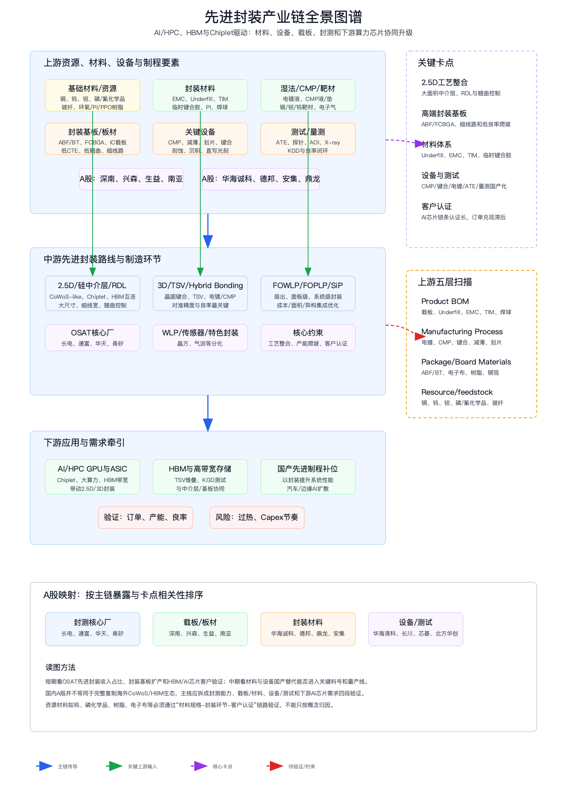

# 先进封装上下游产业链与A股公司分析报告

> 分析日期：2026-06-25  
> 研究范围：先进封装产业链，重点覆盖AI/HPC、HBM、Chiplet相关的2.5D/3D、Fan-out、SiP、WLP/Bumping、FCBGA/IC载板、封装材料、设备和测试环节。  
> 分析口径：以A股公司公开主营、产品、公告与行情快照为证据基础；产业占比未披露时标注“未披露/需核验”。本文为产业研究与情景分析，不构成个股投资建议。

## 1. 核心结论

1. 先进封装的产业价值来自“先进制程延伸 + Chiplet异构集成 + HBM高带宽互连”三条需求共振，核心机会不只在封测制造，还包括封装基板、Underfill/EMC/TIM/临时键合胶、CMP/电镀/键合/测试设备，以及上游树脂、电子布、铜箔、钨/钽/铜靶材、磷/氟化学品等关键输入。
2. A股最直接的主链映射是长电科技、通富微电、华天科技、甬矽电子等封测厂；但若只看制造环节会漏掉真正卡点。当前更稀缺的价值池在ABF/FCBGA载板、2.5D/RDL工艺整合、混合键合、TSV电镀/CMP、先进测试、封装材料认证和量产良率。
3. 国内A股尚不能简单等同于海外CoWoS/HBM完整生态。更稳妥的投资线索是：OSAT先进封装收入占比提升、封装基板与板材放量、材料进入关键料号、设备进入量产线、下游AI芯片或HBM客户验证落地。
4. 关键卡脖子分层看：高端封装基板和大尺寸2.5D工艺是系统级卡点；Underfill、EMC、TIM、临时键合胶、CMP材料、电镀液是材料级卡点；CMP、减薄、划切、键合、刻蚀/沉积、直写光刻、ATE和量测是设备级卡点。
5. 交易层面，先进封装已经是高热主题，长电科技、通富微电、华天科技等核心封测股和载板/设备/材料链均出现高估值或高弹性特征。买点应更多依赖订单、产能利用率、客户认证、年报/季报先进封装占比和股价回踩确认，而不是仅追概念。

## 2. 研究对象、边界与口径

| 项目 | 定义 |
| --- | --- |
| 分析对象 | 先进封装产业链，重点为AI/HPC、HBM、Chiplet、国产高性能芯片相关的封装技术和供应链 |
| 纳入主线 | 2.5D中介层/RDL、3D/TSV、Hybrid Bonding、Fan-out/FOPLP、SiP、WLP/Bumping、FCBGA/IC载板、封装材料、设备与测试 |
| 上游拆分 | Product BOM、Manufacturing Process、Package/Board Materials、Resource/feedstock、Adjacent infrastructure五层扫描 |
| 相邻链路 | HBM、GPU/ASIC、服务器、液冷、光模块、EDA/IP、晶圆制造设备；仅作为需求或技术相邻，不混入主链排序 |
| A股筛选口径 | 主营/产品直接涉及优先；产业占比未披露时以“主营相关、占比待核验”处理；避免仅凭概念板块纳入 |
| 交易口径 | 引入行情快照、估值和趋势语言，用于跟踪框架；不输出确定性收益承诺 |

## 3. 行业背景与需求驱动

AI训练和推理需要更高算力密度、更宽片间带宽和更低系统功耗。先进制程成本上升后，Chiplet把大芯片拆成多个小芯粒，通过2.5D中介层、RDL、硅桥或高端封装基板实现高速互连；HBM则通过TSV堆叠和2.5D封装与GPU/ASIC协同。由此，封装从后道“保护和引脚连接”升级为影响系统性能、良率和成本的核心环节。

| 驱动 | 方向 | 影响环节 | 传导逻辑 | 证据强度 |
| --- | --- | --- | --- | --- |
| AI/HPC算力芯片升级 | 正向 | 2.5D、RDL、载板、测试 | 大算力芯片需要高带宽、低延迟和高良率异构集成 | 高 |
| HBM渗透提升 | 正向 | TSV、CMP、电镀、KGD测试、Underfill | HBM与GPU/ASIC共同封装，对堆叠、良率和热管理要求更高 | 高 |
| 国产先进制程补位 | 正向 | Fan-out、SiP、Chiplet、封装材料/设备 | 通过系统级封装提升性能，部分补偿先进制程受限 | 中高 |
| 先进封装产能扩张 | 正向但周期 | OSAT、基板、设备、材料 | 扩产拉动设备材料订单，但存在资本开支和利用率周期 | 中高 |
| 技术路线不确定 | 分化 | 2.5D、FOPLP、Hybrid Bonding、硅桥 | 路线差异会改变载板、材料和设备的价值分布 | 中 |

## 4. 产业链全景图谱

| 环节 | 细分领域 | 角色 | 关键输入 | 关键输出 | 价值/成本驱动 | 代表A股公司 |
| --- | --- | --- | --- | --- | --- | --- |
| 上游资源/化工 | 铜、钨、钽、磷/氟化学品、玻纤、环氧/PI/PPO树脂、电子布、铜箔 | 支撑靶材、湿法材料、载板和封装材料 | 金属、化学品、树脂、玻纤 | 靶材、CMP/电镀材料、低损耗板材 | 纯度、稳定供应、客户认证 | 江丰电子、兴发集团等需按链路核验；生益科技、南亚新材 |
| 上游封装材料 | EMC、Underfill、TIM、临时键合胶、PI、焊球、导热/导电胶 | 影响可靠性、热管理、翘曲和良率 | 树脂、填料、助剂、金属粉 | 封装胶材、塑封料、导热材料 | 料号认证、可靠性、低应力、低翘曲 | 华海诚科、德邦科技、鼎龙股份 |
| 上游载板/板材 | ABF/BT、FCBGA、IC载板、CCL、电子布、铜箔 | 承载芯片互连和系统信号完整性 | 树脂、玻纤、铜箔、填料 | 封装基板、高端板材 | 细线路、低CTE、低翘曲、良率 | 深南电路、兴森科技、生益科技、南亚新材 |
| 上游设备/测试 | CMP、减薄、划切、键合、刻蚀、沉积、直写光刻、ATE、AOI/X-ray | 决定制程能力、产能和良率 | 设备、耗材、工艺配方 | 量产线能力和测试闭环 | 设备精度、工艺窗口、客户导入 | 华海清科、长川科技、芯碁微装、中微公司、北方华创、拓荆科技 |
| 中游封测制造 | 2.5D、3D、TSV、Fan-out、SiP、WLP/Bumping | 把裸片、HBM、基板和材料集成为可用芯片封装 | 晶圆、KGD、基板、材料、设备 | 高性能封装产品 | 先进封装占比、客户认证、产能利用率 | 长电科技、通富微电、华天科技、甬矽电子、晶方科技 |
| 下游应用 | AI GPU/ASIC、HBM、服务器、汽车电子、边缘AI | 拉动先进封装需求 | 芯片设计、晶圆制造、封装产能 | 高性能系统芯片 | 终端CAPEX、产品代际、供应链安全 | A股多为上游供应映射 |

主链应按“资源/材料/设备/载板 -> 封测制造 -> AI/HPC/HBM下游”阅读。HBM、GPU、服务器和液冷是需求牵引或相邻基础设施，不能替代先进封装本体的供应链分析。

## 5. 上游材料、部件与制程要素挖掘

| 上游层级 | 细分材料/部件 | 对目标产业的作用 | 价值/稀缺性 | 卡脖子程度 | A股候选 | 纳入主线判断 |
| --- | --- | --- | --- | --- | --- | --- |
| Product BOM | ABF/BT载板、FCBGA、硅中介层、RDL、焊球、Underfill、EMC、TIM | 构成先进封装实体，直接影响互连密度、热管理、翘曲和可靠性 | 高；高端载板和关键胶材认证周期长 | High | 深南电路、兴森科技、华海诚科、德邦科技 | Core |
| Manufacturing Process | TSV电镀、CMP、减薄、划片、混合键合、临时键合/解键合、刻蚀/沉积 | 决定2.5D/3D/Hybrid Bonding工艺能力和良率 | 高；工艺窗口窄，量产导入难 | High | 华海清科、安集科技、鼎龙股份、中微公司、北方华创、拓荆科技 | Core/Important |
| Package/Board Materials | CCL、低CTE树脂、电子布、铜箔、BT/ABF树脂体系、PI材料 | 支撑封装基板和高可靠封装材料 | 中高；细线路、低损耗和低翘曲材料认证较难 | Medium/High | 生益科技、南亚新材、鼎龙股份 | Important |
| Resource/feedstock | 铜、钨、钽、磷/氟化学品、玻纤、环氧树脂、PI/PPO单体、硅粉填料 | 传导到靶材、湿法材料、载板、塑封料和导热材料 | 分化；价格周期和供应安全为主，需看电子级纯度 | Medium | 江丰电子、兴发集团等需进一步核验；生益科技、南亚新材 | Important/Commodity |
| Adjacent infrastructure | HBM、GPU/ASIC、EDA/IP、服务器、液冷、光模块 | 形成需求和系统约束，但不是封装供应链本体 | 高，但链路间接 | Medium | 香农芯创、佰维存储、英维克等仅作相邻观察 | Adjacent |

五层扫描结论：先进封装不能只从“封测厂”出发，必须把上游拆到材料和制程。钨、钽、铜对应靶材和互连；磷/氟化学品对应湿法/CMP/阻燃和树脂体系；树脂、电子布、铜箔对应封装基板；EMC、Underfill、TIM和临时键合胶对应可靠性和热管理；设备与测试决定良率爬坡。

## 6. 产业链核心环节价值分布

| 产业链环节 | 细分领域/关键产品 | BOM成本占比/价值占比 | 核心技术壁垒 | 卡脖子程度 | 代表A股公司 | 公司环节地位 | 证据口径/备注 |
| --- | --- | --- | --- | --- | --- | --- | --- |
| 封测制造 | 2.5D、3D、Fan-out、SiP、WLP/Bumping | 收入主线；先进封装占比越高，盈利弹性越强 | 工艺整合、良率、客户认证、产能爬坡 | Medium/High | 长电科技、通富微电、华天科技、甬矽电子 | 核心环节龙头/挑战者 | 主营直接覆盖封装测试，先进封装占比需按公告拆分 |
| 高端封装基板 | FCBGA、ABF/BT、IC载板、CSP载板 | 高；高性能芯片封装关键成本项之一 | 细线路、低翘曲、低CTE、良率和客户认证 | High | 深南电路、兴森科技 | 关键配套/国产替代 | 产品直接覆盖封装基板，FCBGA放量是关键验证 |
| 封装材料 | EMC、Underfill、TIM、临时键合胶、PI、电子胶 | 中高；影响可靠性和良率，认证后粘性强 | 低应力、低翘曲、导热、可靠性、料号认证 | High | 华海诚科、德邦科技、鼎龙股份 | 关键技术突破者/重要配套 | 主营覆盖封装材料，需核验高端先进封装料号 |
| CMP/湿法/靶材 | CMP液/垫、电镀液、湿电子化学品、铜/钽/钨靶材 | 中高；TSV、RDL和晶圆级制程关键耗材 | 超高纯、缺陷控制、稳定供货 | High | 安集科技、鼎龙股份、江丰电子 | 关键材料供应商 | 与晶圆制造和先进封装共用，封装端占比需核验 |
| 设备与测试 | CMP、减薄、划切、键合、刻蚀/沉积、直写光刻、ATE/AOI | 资本开支主线；订单与扩产高度相关 | 精度、吞吐量、工艺窗口、客户验证 | High | 华海清科、长川科技、芯碁微装、中微公司、北方华创、拓荆科技 | 核心设备/重要配套 | 部分设备更偏前道，先进封装直接占比需拆分 |
| 上游板材 | CCL、电子布、树脂、铜箔、低损耗材料 | 中；封装基板和高端PCB基础材料 | 低损耗、低CTE、耐热、细线路适配 | Medium | 生益科技、南亚新材 | 上游核心材料 | 与封装基板相关，但需与PCB主业区分 |

价值分布的关键判断是：封测厂是收入兑现主线，但真正决定先进封装可持续国产化的是“高端基板 + 关键材料 + 核心设备/测试 + 良率工艺”。因此，公司排序不能只看封测概念，还要看是否处在难替代的关键料号或设备导入环节。

## 7. 竞争格局与核心壁垒

| 环节/细分 | 全球参考体系 | 中国/A股映射 | 壁垒类型 | 国产化状态 | 核心瓶颈 |
| --- | --- | --- | --- | --- | --- |
| 2.5D/CoWoS-like | 台积电CoWoS及海外先进封装生态 | 长电科技、通富微电、华天科技等 | 工艺整合、客户认证、产能规模 | 追赶中 | 大面积中介层、RDL、翘曲和良率 |
| HBM/3D堆叠 | 海外存储大厂和OSAT协同 | A股主要间接受益 | TSV、键合、KGD测试、热管理 | 间接映射多 | 国内HBM和客户生态验证 |
| 高端封装基板 | 日本、韩国、中国台湾供应链强 | 深南电路、兴森科技 | ABF材料、细线路、良率、客户认证 | 国产替代推进 | FCBGA/ABF稳定量产 |
| 封装材料 | 日美欧材料体系成熟 | 华海诚科、德邦科技、鼎龙股份 | 可靠性、料号认证、配方和客户粘性 | 分品类突破 | 高端料号进入AI/HBM封装 |
| 设备与测试 | 海外设备商强势 | 华海清科、长川科技、芯碁微装等 | 精度、吞吐量、软件/工艺配方 | 局部突破 | 先进封装专用设备导入比例 |

竞争格局呈现“封测制造追赶、基板材料补短板、设备测试国产替代、下游客户认证决定兑现”的结构。A股封测厂具备直接收入弹性，但与海外领先生态相比仍需要在先进封装占比、2.5D/3D工艺能力和客户结构上继续验证。

## 8. A股公司映射与核心地位判断

| 公司 | 代码 | 环节 | 细分领域 | 产业占比/暴露度 | 核心技术/产品 | 卡脖子相关性 | 环节地位 | 证据与备注 |
| --- | --- | --- | --- | --- | --- | --- | --- | --- |
| 长电科技 | 600584 | 中游封测 | 一站式芯片成品制造、先进封装 | 主营直接覆盖封装测试；先进封装占比需年报拆分 | 微系统集成、晶圆中测、封装、测试、先进封装 | Medium/High | 核心环节龙头 | 2026-06-25快照涨停，动态PE约160.5，市场热度高 |
| 通富微电 | 002156 | 中游封测 | 集成电路封装测试 | 主营为封装测试，一站式服务；AI/HPC占比需核验 | 封装测试、先进封装产能 | Medium/High | 核心环节龙头 | 快照涨幅约3.7%，动态PE约89.2 |
| 华天科技 | 002185 | 中游封测 | FC、MCM、SiP、WLP、TSV、Bumping、FO、PLP、2.5D/3D | 主营直接覆盖封装测试，先进路线披露较完整 | 多形态封装测试和晶圆级封装 | Medium/High | 核心环节龙头 | 产品名称覆盖2.5D/3D等路线，快照涨幅约5.3% |
| 甬矽电子 | 688362 | 中游封测 | FC、SiP、Bumping/WLP、QFN/DFN、MEMS | 主营为封装测试，规模较龙头小 | 倒装、系统级、晶圆级封装 | Medium | 关键挑战者 | 快照动态PE约323.9，估值对成长兑现敏感 |
| 晶方科技 | 603005 | 特色封装 | 传感器WLP、Fan-out芯片级封装 | 主营为传感器封测，先进封装相关但AI/HPC直接度偏弱 | WLP、Fan-out、光学器件封装 | Medium | 特色封装龙头 | 适合归入WLP/传感器特色链，不宜直接等同CoWoS主线 |
| 深南电路 | 002916 | 上游载板 | PCB、封装基板、电子装联 | 主营含封装基板；FCBGA等高端占比需核验 | IC封装基板、高端PCB | High | 关键配套龙头 | 快照动态PE约88.2，先进封装载板主线直接 |
| 兴森科技 | 002436 | 上游载板/测试板 | PCB、IC封装基板、半导体测试板 | 主营含CSP/FCBGA封装基板和ATE测试板 | FCBGA、CSP封装基板、测试板 | High | 关键配套/国产替代 | 快照动态PE较高，需看FCBGA放量和盈利兑现 |
| 生益科技 | 600183 | 上游板材 | 覆铜板、粘结片、电子玻璃布、树脂、铜箔 | 主营为CCL/粘结片，封装基板材料相关 | 低损耗CCL、树脂、电子级玻璃布、铜箔 | Medium | 上游核心材料 | 对载板/PCB基础材料有暴露，但需拆分先进封装占比 |
| 南亚新材 | 688519 | 上游板材 | CCL、prepreg、高速/高频/HDI/IC基板材料 | 主营含IC基板材料 | 高速高频板材、IC载板材料 | Medium | 上游核心材料 | 快照动态PE约144.9，材料升级弹性强但估值高 |
| 华海诚科 | 688535 | 封装材料 | 环氧塑封料、电子胶黏剂 | 主营为半导体封装材料 | EMC、电子胶黏剂 | High | 关键材料供应商 | 先进封装料号认证是核心验证 |
| 德邦科技 | 688035 | 封装材料 | 高端电子封装材料 | 主营覆盖IC封装、导电/导热/电磁屏蔽、结构粘合材料 | 导热/导电/屏蔽/密封材料 | High | 关键材料供应商 | 直接受益于高可靠封装材料国产替代 |
| 安集科技 | 688019 | 湿法/CMP材料 | CMP抛光液、湿电子化学品、电镀液及添加剂 | 主营高端半导体材料，封装端占比需核验 | CMP液、湿法材料、电镀液 | High | 关键制程材料 | TSV/RDL/CMP相关性高，快照毛利率较高 |
| 鼎龙股份 | 300054 | CMP/封装材料 | CMP抛光垫/液、临时键合胶、半导体封装PI | 主营明确含半导体先进封装材料 | CMP材料、YPI/PSPI、临时键合胶、封装PI | High | 关键材料突破者 | 与先进封装材料链直接相关，快照动态PE约89.3 |
| 江丰电子 | 300666 | 靶材/精密零部件 | 超高纯金属溅射靶材 | 主营含铜、钽、钨等靶材；封装端占比需核验 | 高纯铜/钽/钨靶材及零部件 | Medium/High | 关键材料供应商 | 与先进制程和部分封装制程共振 |
| 华海清科 | 688120 | 设备 | CMP、减薄、划切、边缘抛光、湿法 | 主营半导体专用设备，先进封装直接占比需核验 | CMP、减薄、划切等设备 | High | 核心设备供应商 | 对TSV/CMP/减薄工艺相关性高 |
| 长川科技 | 300604 | 测试设备 | 测试机、分选机、自动化、AOI | 主营集成电路专用设备 | ATE测试机、分选机、AOI | High | 核心测试设备 | KGD和先进封装测试闭环关键 |
| 芯碁微装 | 688630 | 设备 | 直接成像、直写光刻 | 主营PCB直接成像和泛半导体直写光刻 | LDI、直写光刻、高端线路设备 | Medium/High | 载板设备配套 | 与高端载板细线路相关性高 |
| 中微公司 | 688012 | 设备 | 刻蚀、薄膜、MOCVD | 主营偏前道高端设备，先进封装直接占比需拆分 | 刻蚀、薄膜设备 | Medium | 关键设备/相邻 | 对部分封装制程相关，但不是纯后道标的 |
| 北方华创 | 002371 | 设备 | 半导体装备、真空装备 | 主营电子工艺装备 | 刻蚀、沉积、清洗等装备体系 | Medium | 关键设备/相邻 | 前道属性更强，先进封装为相邻受益 |
| 拓荆科技 | 688072 | 设备 | PECVD、ALD、三维集成领域系列产品 | 主营高端半导体专用设备 | 薄膜沉积、三维集成相关设备 | Medium/High | 关键设备供应商 | 三维集成产品线值得跟踪，封装端收入占比需核验 |

## 9. 投资线索、交易跟踪与目标价情景

| 公司 | 代码 | 产业链结论 | 财务质量 | 当前估值 | 技术面/趋势 | 买点区间 | 止损/失效条件 | 目标价/空间 | 综合判断 |
| --- | --- | --- | --- | --- | --- | --- | --- | --- | --- |
| 长电科技 | 600584 | 先进封装主链封测龙头，受益AI/HPC封装扩产 | 毛利率约13.7%，净利率约2.6%，ROE约1.2% | 动态PE约160.5，PB约6.5 | 当日涨停，成交额约317亿元，短线情绪很强 | 不追涨停，等放量后缩量回踩或先进封装订单/产能确认 | 放量跌破涨停启动平台，或先进封装盈利弹性不及预期 | 情景目标需由盈利上修驱动，估值容错较低 | 核心观察，强主题但需验证利润率改善 |
| 通富微电 | 002156 | 封测核心厂，AI/HPC客户链条弹性直接 | 毛利率约11.2%，净利率约3.0%，ROE约3.4% | 动态PE约89.2 | 当日上涨约3.7%，趋势活跃 | 等回踩均线或订单催化，不在连续放量后追高 | 客户/产能兑现低于预期，行业价格竞争加剧 | 空间来自先进封装收入占比提升 | 核心观察，弹性与波动并存 |
| 华天科技 | 002185 | 封装路线覆盖最完整之一，具备2.5D/3D等披露 | 财务质量需跟踪毛利和费用改善 | 动态PE约211.5 | 当日上涨约5.3%，估值较高 | 等技术回踩或季报确认先进封装放量 | 产品路线有披露但收入占比不清，若兑现慢则估值承压 | 空间取决于先进路线转收入 | 关键观察，验证优先 |
| 深南电路 | 002916 | 载板/PCB核心配套，高端封装基板价值高 | 高端制造属性强，利润率需分业务看 | 动态PE约88.2 | 当日上涨约2.0%，股价绝对水平高 | 等FCBGA/IC载板放量证据或回撤确认 | 封装基板扩产利用率不足 | 空间来自高端载板国产替代 | 关键配套龙头 |
| 兴森科技 | 002436 | FCBGA/CSP基板和测试板受益，弹性高 | 盈利稳定性需改善 | 动态PE极高，估值对兑现敏感 | 当日上涨约3.2% | 只在订单/良率明确改善后考虑 | 高估值下业绩不达预期 | 空间高但回撤风险大 | 高弹性、强验证 |
| 华海诚科 | 688535 | EMC和电子胶黏剂对应封装材料卡点 | 材料认证后粘性强 | 动态PE约390，估值很贵 | 当日小涨，弹性强 | 等关键客户/料号确认或估值消化 | 高端料号导入慢、毛利下滑 | 空间来自先进封装材料放量 | 稀缺材料，风险高 |
| 鼎龙股份 | 300054 | CMP材料、临时键合胶、封装PI横跨关键制程和材料 | 毛利率约54.9%，净利率约25.6% | 动态PE约89.3 | 当日下跌约2.8%，高位波动 | 等回踩企稳或材料客户验证 | 新材料放量低于预期 | 空间来自先进封装材料国产替代 | 材料突破者 |
| 华海清科 | 688120 | CMP/减薄/划切设备与先进封装工艺相关 | 毛利率约42.3%，净利率约20.6% | 动态PE约123.6 | 当日上涨约1.9% | 等设备订单和后道场景占比确认 | 先进封装设备导入不及预期 | 空间来自扩产资本开支 | 核心设备观察 |
| 长川科技 | 300604 | ATE/分选/AOI受KGD和先进封装测试拉动 | 毛利率约56.8%，净利率约26.1% | 动态PE约135.7 | 当日下跌约1.9%，成交额高 | 等回踩企稳和订单确认 | 高估值下订单/利润不达预期 | 空间来自测试国产替代 | 测试核心标的 |

| 机会类型 | 产业链逻辑 | 代表A股公司 | 验证里程碑 | 风险 |
| --- | --- | --- | --- | --- |
| 核心环节龙头 | 封测厂先进封装收入占比提升，AI/HPC订单兑现 | 长电科技、通富微电、华天科技 | 先进封装收入、产能利用率、客户认证、毛利率改善 | 主题过热、利润率低、价格竞争 |
| 关键技术突破者 | 材料/设备进入关键料号或量产线，国产替代弹性大 | 鼎龙股份、华海诚科、华海清科、长川科技 | 客户导入、订单、料号认证、产品毛利 | 认证周期长、估值高 |
| 重要配套 | 高端载板和板材随先进封装扩产放量 | 深南电路、兴森科技、生益科技、南亚新材 | FCBGA/IC载板产能、良率、客户结构 | 扩产折旧压力、需求波动 |
| 间接受益 | HBM、服务器、光模块、液冷同受AI资本开支拉动 | 相邻链公司另行跟踪 | 与先进封装订单传导是否清晰 | 概念混淆、链路过远 |
| 待验证 | 前道设备/资源材料与先进封装存在技术交集 | 中微公司、北方华创、江丰电子等 | 封装端收入占比或客户项目 | 直接度不足 |

## 10. 催化因素与产业传导路径

| 催化因素 | 产业传导路径 | 优先观察公司 | 观察指标 | 时间维度 |
| --- | --- | --- | --- | --- |
| 海外AI芯片迭代和HBM需求提升 | GPU/ASIC + HBM -> 2.5D/3D封装 -> 载板/材料/设备 | 长电科技、通富微电、深南电路、鼎龙股份 | 订单、客户认证、先进封装收入占比 | 1-4个季度 |
| 国内高性能芯片封装需求 | 国产芯片设计 -> 先进封装方案 -> OSAT和材料设备国产化 | 华天科技、甬矽电子、长川科技、华海清科 | 客户项目、产线导入、测试设备订单 | 2-6个季度 |
| FCBGA/IC载板放量 | AI芯片封装 -> 高端基板需求 -> 板材/电子布/树脂传导 | 深南电路、兴森科技、生益科技、南亚新材 | FCBGA良率、产能利用率、毛利率 | 2-8个季度 |
| 先进封装材料国产替代 | 可靠性验证 -> 料号切换 -> 批量采购 | 华海诚科、德邦科技、鼎龙股份、安集科技 | 料号认证、客户结构、材料收入 | 2-8个季度 |
| 设备国产化导入 | 扩产CAPEX -> 设备采购 -> 工艺验证 | 华海清科、长川科技、芯碁微装、拓荆科技 | 订单、验收、收入确认 | 1-6个季度 |

产业传导路径可概括为：AI/HPC需求先驱动先进封装产能扩张，封测厂最先体现主题弹性；随后扩产订单传导到设备和基板；再往后材料端通过料号认证和批量导入兑现利润。若下游CAPEX放缓，封测和设备最先承压，材料由于认证粘性可能滞后但也会受量影响。

## 11. 风险提示

1. 先进封装主题热度高，部分公司动态PE和PB已经较高，若订单或利润不及预期，估值回撤可能明显。
2. A股公司多数未披露先进封装精确收入占比，存在“主营相关但弹性被高估”的风险。
3. 高端封装基板、EMC/Underfill/TIM、临时键合胶、CMP/电镀材料等需要长周期客户认证，量产导入可能慢于预期。
4. 海外CoWoS/HBM生态具有客户、工艺和产能先发优势，国内供应链短期不宜简单对标完整替代。
5. AI资本开支、HBM供需、GPU/ASIC代际、封装技术路线变化会影响价值分布，可能使既有产能或材料路线边际降温。
6. 行情数据为采样快照，交易买点、目标价和技术面仅用于跟踪框架，不构成买卖建议。

## 12. 数据来源、证据强度与待核验事项

| 结论/数据 | 来源 | 日期 | 置信度 |
| --- | --- | --- | --- |
| 长电科技、通富微电、华天科技、甬矽电子、晶方科技主营涉及封装测试/先进封装 | 上市公司主营业务与公开公告聚合数据 | 2026-06-25 | High |
| 深南电路、兴森科技主营覆盖封装基板/IC载板/测试板 | 上市公司主营业务与公开公告聚合数据 | 2026-06-25 | High |
| 华海诚科、德邦科技、鼎龙股份、安集科技主营覆盖封装材料、CMP/湿法和先进封装材料 | 上市公司主营业务与公开公告聚合数据 | 2026-06-25 | High |
| 华海清科、长川科技、芯碁微装、中微公司、北方华创、拓荆科技具备设备/测试相关产品 | 上市公司主营业务与公开公告聚合数据 | 2026-06-25 | High |
| 行情、PE、PB、毛利率、净利率等为采样快照 | 公开行情与基础信息接口采样 | 2026-06-25 | Medium |
| 先进封装价值分布与卡点判断 | 产业链方法论、公司主营证据和技术路线推理 | 2026-06-25 | Medium |

待核验事项：

1. 各公司先进封装收入占比、AI/HPC客户占比和具体料号导入情况。
2. FCBGA/ABF载板产能、良率、客户结构和折旧压力。
3. 华海诚科、德邦科技、鼎龙股份等材料公司在Underfill、EMC、TIM、临时键合胶等高端料号的量产认证进度。
4. 华海清科、长川科技、芯碁微装等设备测试公司在先进封装专用产线的订单和收入确认节奏。
5. 钨、磷化学品、树脂、电子布等上游材料需进一步用料号、电子级规格和客户认证证明其进入先进封装主链。
