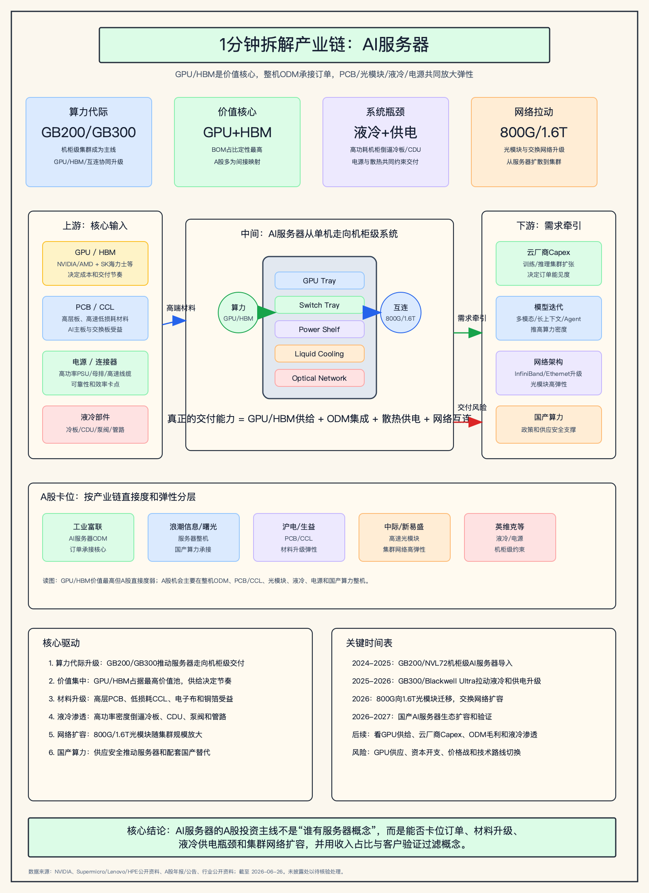

# AI服务器上下游产业链与A股公司分析报告

> 分析日期：2026-06-26  
> 研究范围：全球AI服务器及中国A股可映射环节；覆盖GPU/HBM、整机ODM、PCB/CCL、光模块、液冷、电源、连接器、机柜和云厂商需求。  
> 分析口径：AI服务器指面向大模型训练、推理和高性能AI集群的GPU/加速卡服务器、机柜级系统和配套网络设备；不把普通通用服务器等同为AI服务器。

## 0. 核心结论

1. AI服务器的核心价值池在GPU/加速器、HBM和高速互连，A股直接掌握GPU/HBM核心价值的公司较少，主要投资映射落在整机ODM/集成、PCB/CCL、光模块、液冷、电源和国产算力整机。
2. 产业链已经从“单台GPU服务器”升级为“机柜级AI系统”：GB200/GB300 NVL72等形态把GPU、CPU、NVLink/交换、液冷、电源和光网络绑定在一起，交付能力比单一零部件更重要。
3. A股直接度排序上，工业富联偏全球AI服务器ODM订单承接；浪潮信息、中科曙光偏国内AI服务器和国产算力；沪电股份、生益科技、深南电路、胜宏科技偏PCB/CCL材料升级；中际旭创、新易盛、天孚通信偏集群光互连；英维克、申菱环境、高澜股份偏液冷和热管理。
4. 当前利润传导呈现“高价值核心器件海外集中、A股配套弹性放大”的结构：GPU/HBM决定订单节奏，ODM确认收入，PCB/CCL和光模块享受规格升级，液冷/电源受机柜功率密度提升约束带动。
5. 最大风险是把普通服务器、普通PCB、普通散热或普通光模块全部贴上AI服务器标签；真正的产业暴露必须看AI服务器收入占比、客户、产品规格、订单、产能和是否进入英伟达/云厂商/国产算力生态。

## 1. 研究对象、边界与口径

| 项目 | 定义 |
| --- | --- |
| 分析对象 | AI服务器、GPU服务器、机柜级AI计算系统及其关键配套 |
| 纳入主线 | GPU/HBM、CPU/DPU/NIC、服务器主板与高层PCB、低损耗CCL、整机ODM、液冷、电源、光模块、交换网络、机柜 |
| 相邻链路 | 数据中心土建、电网变压器、UPS、IDC运营、国产AI芯片、服务器操作系统和集群调度软件 |
| 弱相关/排除 | 普通办公服务器、传统风冷通用服务器、无AI客户/高端规格披露的普通PCB或散热产品 |
| 核心指标 | GPU供给、HBM容量、服务器出货/订单、AI服务器收入占比、PCB层数和材料等级、液冷渗透率、光模块速率、云厂商资本开支 |
| A股映射口径 | 公司年报/公告/投关披露优先；未披露AI服务器收入占比时标注“未披露/待核验” |

## 2. 行业背景与需求驱动

大模型训练和推理把服务器从单机算力竞争推向集群工程竞争。GPU性能提升带来更高功耗、更高HBM容量、更高板级互连密度和更复杂的网络拓扑，传统风冷和普通服务器架构难以支撑机柜级密度。以NVIDIA Blackwell平台为代表，AI服务器正在向整柜交付、液冷交付和网络一体化演进。

这意味着AI服务器产业链不应只看整机品牌，还要倒着拆：云厂商资本开支决定需求，GPU/HBM决定供给节奏，ODM决定交付，PCB/CCL、光模块、液冷、电源和连接器决定机柜级系统能否稳定运行。A股机会更多来自这些配套环节的规格升级和国产替代，而不是GPU核心价值本身。

| 驱动 | 方向 | 影响环节 | 传导逻辑 | 证据强度 |
| --- | --- | --- | --- | --- |
| 大模型训练和推理需求 | 正向 | AI服务器、GPU、光网络 | 模型规模和推理流量增长 -> 算力集群扩张 -> 服务器和网络需求提升 | 高 |
| Blackwell/Ultra代际升级 | 正向 | 整机ODM、液冷、电源、PCB | 机柜功耗和互连密度提升 -> 液冷/供电/高层板规格升级 | 高 |
| HBM供给与封装产能 | 正向但约束 | GPU/HBM、先进封装 | HBM供给决定GPU交付，进而影响整机收入确认 | 高 |
| 800G/1.6T光互连升级 | 正向 | 光模块、光器件、交换网络 | GPU集群规模扩大 -> 交换网络扩容 -> 高速光模块需求上升 | 中高 |
| 国产算力和供应安全 | 正向但分化 | 国产AI服务器、国产芯片和系统 | 政策和供应限制推动国产替代，但生态、性能和客户验证决定兑现 | 中高 |
| 云厂商Capex波动 | 负向/分化 | 全链条 | 资本开支若放缓，ODM、PCB、光模块和液冷订单都会受影响 | 高 |

## 3. 产业链全景图谱

| 环节 | 细分领域 | 角色 | 关键输入 | 关键输出 | 价值/成本驱动 | 代表A股公司 |
| --- | --- | --- | --- | --- | --- | --- |
| 上游核心芯片 | GPU/加速器、CPU、HBM、DPU/NIC | 决定算力性能和成本底座 | 晶圆、先进封装、HBM、CoWoS/类CoWoS | GPU模组、加速卡、计算节点 | GPU供给、HBM容量、封装产能 | 寒武纪、海光信息、龙芯中科等国产算力映射 |
| 上游材料/部件 | PCB、CCL、电子布、铜箔、连接器、电源、散热件 | 支撑高功耗、高速信号和可靠性 | 低损耗树脂、玻纤布、铜箔、泵阀、冷板 | 主板、交换板、电源模组、液冷系统 | 层数、材料等级、良率、认证 | 沪电股份、生益科技、深南电路、胜宏科技、英维克 |
| 中游整机/ODM | GPU服务器、整柜、国产AI服务器 | 把芯片、板卡、散热和网络集成 | GPU/HBM、主板、电源、机柜、冷却 | AI服务器、机柜级系统 | 客户订单、交付能力、毛利率 | 工业富联、浪潮信息、中科曙光、紫光股份 |
| 网络互连 | 交换机、800G/1.6T光模块、光器件、DAC/AEC | 连接GPU集群 | DSP/硅光/EML、光芯片、FAU、连接器 | 光模块、交换网络 | 速率升级、端口密度、客户份额 | 中际旭创、新易盛、天孚通信、光迅科技 |
| 下游应用 | 云厂商、互联网、运营商、科研、金融政企 | 形成最终需求 | 数据中心、电力、模型和应用 | 训练/推理算力服务 | Capex、利用率、模型商业化 | 阿里/腾讯/字节等非A股；IDC和云生态间接受益 |

## 4. 上游材料、部件与制程要素挖掘

| 上游层级 | 细分材料/部件 | 对目标产业的作用 | 价值/稀缺性 | 卡脖子程度 | A股候选 | 纳入主线判断 |
| --- | --- | --- | --- | --- | --- | --- |
| Product BOM | GPU、CPU、HBM、DPU/NIC、NVLink/交换芯片 | 决定AI服务器性能、成本和供给节奏 | 极高；全球核心供应商集中 | High | 海光信息、寒武纪、龙芯中科等国产映射 | Core/Important |
| Product BOM | 高层PCB、服务器主板、交换板、加速卡板 | 支撑高速信号完整性和高功耗系统 | 高；AI服务器层数、材料和良率要求提升 | Medium/High | 沪电股份、深南电路、胜宏科技、景旺电子 | Core/Important |
| Board/package materials | 低损耗CCL、电子布、铜箔、树脂、半固化片 | 决定PCB高频高速性能和可靠性 | 中高；高端材料国产替代空间大 | Medium/High | 生益科技、华正新材、中国巨石、宏和科技 | Important |
| Manufacturing Process | SMT、整机组装、散热集成、测试验证 | 决定订单能否按期交付 | 高；机柜级交付复杂度提升 | Medium | 工业富联、浪潮信息、中科曙光 | Core |
| Adjacent infrastructure | 冷板、CDU、泵阀、管路、冷却液、电源/UPS、机柜 | 高功耗机柜运行所需 | 高；GB200/GB300等机柜推动液冷和供电升级 | Medium/High | 英维克、申菱环境、高澜股份、欧陆通、麦格米特 | Important/Adjacent |
| Adjacent infrastructure | 光模块、光器件、交换机、光纤连接 | 集群规模扩张的网络瓶颈 | 高；800G/1.6T升级带来高弹性 | Medium/High | 中际旭创、新易盛、天孚通信、光迅科技、紫光股份 | Important |

五层扫描结论：AI服务器不能只看服务器厂商。GPU/HBM是价值最高且供给最紧的核心BOM；PCB/CCL、液冷、电源和光模块是A股弹性更强的配套层；IDC、电力和UPS属于相邻基础设施，除非有明确AI数据中心订单，否则不宜排进核心公司表前列。

## 5. 产业链核心环节价值分布

| 产业链环节 | 细分领域/关键产品 | BOM成本占比/价值占比 | 核心技术壁垒 | 卡脖子程度 | 代表A股公司 | 公司环节地位 | 证据口径/备注 |
| --- | --- | --- | --- | --- | --- | --- | --- |
| 核心算力 | GPU/AI加速器、HBM | 定性最高；通常为AI服务器BOM最大价值池 | GPU架构、HBM、先进封装、软件生态 | High | 海光信息、寒武纪等国产映射 | 国产替代/挑战者 | 全球核心仍由NVIDIA/AMD及HBM厂主导，A股多为国产替代口径 |
| 整机/ODM | GPU服务器、整柜、机柜级系统 | 高；收入确认大但毛利率受客户和BOM约束 | 大客户认证、供应链管理、液冷整合、测试 | Medium/High | 工业富联、浪潮信息、中科曙光 | 核心承接 | AI服务器收入占比和客户结构需逐家公司核验 |
| PCB/CCL | 高层板、高速低损耗材料、交换板 | 中高；规格升级带来单机价值量提升 | 层数、良率、信号完整性、低损耗材料 | Medium/High | 沪电股份、生益科技、深南电路、胜宏科技 | 重要配套/高弹性 | 受AI服务器和交换机共同拉动 |
| 光互连 | 800G/1.6T光模块、FAU、光器件 | 中高；随集群规模放大 | 高速设计、硅光/EML、客户认证、良率 | Medium/High | 中际旭创、新易盛、天孚通信、光迅科技 | 核心配套/下游高弹性 | 网络侧弹性有时高于服务器整机 |
| 液冷/热管理 | 冷板、CDU、泵阀、管路、机房液冷 | 中；从可选项变为高功耗机柜约束 | 流体设计、可靠性、泄漏控制、交付经验 | Medium | 英维克、申菱环境、高澜股份 | 重要配套 | 订单和收入确认滞后于GPU平台放量 |
| 电源/连接器 | PSU、母排、连接器、高速线缆、UPS | 中；功率密度提升带来升级 | 高效率、高可靠性、安规、客户认证 | Medium | 欧陆通、麦格米特、立讯精密、沃尔核材 | 重要配套/相邻 | 需区分AI服务器电源与普通电源收入 |

AI服务器利润池的第一性排序是：GPU/HBM最高，整机ODM承接订单但毛利率未必最高，PCB/CCL和光模块受规格升级具备更高弹性，液冷/电源是机柜级系统从“能设计”到“能交付”的约束环节。A股公司排序应按直接收入、客户验证和规格升级弹性，而不是概念热度。

## 6. 竞争格局与核心壁垒

| 环节/细分 | 全球领导者/参考体系 | 中国/A股映射 | 壁垒类型 | 国产化状态 | 核心瓶颈 |
| --- | --- | --- | --- | --- | --- |
| GPU/HBM | NVIDIA、AMD、SK海力士、三星、美光 | 海光信息、寒武纪等国产算力 | 架构、软件生态、HBM、先进封装 | 国产替代推进但差距仍大 | GPU供给、HBM、生态 |
| 整机ODM | Foxconn、Quanta、Wistron、Supermicro、Dell、HPE | 工业富联、浪潮信息、中科曙光 | 大客户认证、供应链、交付 | 全球和国内双线竞争 | GPU配给、毛利率、交付良率 |
| PCB/CCL | 日美台高端材料和PCB厂 | 沪电股份、生益科技、深南电路、胜宏科技 | 高层板、低损耗材料、良率 | 国内龙头进入高端 | 高端材料和客户认证 |
| 光模块/器件 | Coherent、Broadcom、Marvell、全球模块厂 | 中际旭创、新易盛、天孚通信、光迅科技 | 高速设计、光芯片、硅光、客户份额 | 国内龙头全球竞争力强 | 价格下行和代际切换 |
| 液冷/热管理 | Vertiv、Schneider等数据中心热管理厂 | 英维克、申菱环境、高澜股份 | 工程交付、可靠性、客户认证 | 国内供应链加速 | 规模化交付和毛利 |
| 电源/连接 | Delta、Lite-On、Amphenol、Molex等 | 欧陆通、麦格米特、立讯精密、沃尔核材 | 效率、可靠性、安规、精密制造 | 部分国产替代 | 高功率密度和客户认证 |

AI服务器产业链呈现“海外核心芯片强势、国内配套链条深度参与”的格局。整机厂的收入规模更直接，但上游规格升级环节可能有更好的利润弹性；液冷和电源在高功率机柜中重要性上升，但需要用订单和客户验证过滤主题波动。

## 7. A股公司映射与核心地位判断

| 公司 | 代码 | 环节 | 细分领域 | 产业占比/暴露度 | 核心技术/产品 | 卡脖子相关性 | 环节地位 | 证据与备注 |
| --- | --- | --- | --- | --- | --- | --- | --- | --- |
| 工业富联 | 601138 | 中游整机/ODM | AI服务器、云计算设备、整柜交付 | 未披露完整AI服务器收入占比；云计算/AI服务器为核心增长口径 | 高端服务器制造、全球客户交付、供应链管理 | Medium | 核心承接/ODM龙头 | 需关注大客户订单、GPU平台切换和毛利率 |
| 浪潮信息 | 000977 | 中游整机 | AI服务器、通用服务器、液冷服务器 | 未披露精确AI服务器占比；服务器主营 | AI服务器整机、国产与海外生态适配 | Medium | 国内整机龙头 | 直接度高，但受GPU供给和竞争影响 |
| 中科曙光 | 603019 | 中游整机/国产算力 | 高性能计算、AI服务器、液冷数据中心 | 未披露AI服务器单独占比 | HPC/AI服务器、液冷和国产算力生态 | Medium/High | 国产算力核心承接 | 受政策和国产生态拉动，需看订单兑现 |
| 沪电股份 | 002463 | 上游PCB | 高速高层PCB、服务器/交换机板 | 未披露AI服务器单独占比；高速通信板占比高 | 高层板、HDI/高速PCB | Medium/High | PCB核心配套 | AI服务器和交换机规格升级受益 |
| 生益科技 | 600183 | 上游材料 | 高速覆铜板、低损耗CCL | 未披露AI服务器单独占比 | 高速高频CCL、封装/服务器材料 | Medium/High | 材料核心配套 | 受高层PCB和交换板材料升级拉动 |
| 深南电路 | 002916 | 上游PCB/封装基板 | 通信PCB、服务器/数据中心PCB、封装基板 | 未披露AI服务器单独占比 | 高多层PCB、封装基板、电子装联 | Medium | 重要配套 | 客户结构和产能利用率决定弹性 |
| 胜宏科技 | 300476 | 上游PCB | AI服务器PCB、GPU板、交换机板 | 未披露精确占比；AI相关增长需核验 | 高多层板、高速PCB | Medium | 高弹性配套 | 关注产能、客户和高端板占比 |
| 中际旭创 | 300308 | 网络互连 | 800G/1.6T高速光模块 | 未披露AI服务器单独占比；数通光模块为核心 | 高速光模块、硅光/EML路线 | Medium/High | 光模块龙头 | AI集群网络高弹性，受价格和客户份额影响 |
| 新易盛 | 300502 | 网络互连 | 高速光模块 | 未披露AI服务器单独占比 | 800G/1.6T光模块、数据中心互连 | Medium/High | 光模块核心配套 | 与海外云客户和速率升级相关 |
| 天孚通信 | 300394 | 网络器件 | FAU、微光学、光引擎配套 | 未披露AI服务器单独占比 | 光无源器件、FAU、微光学平台 | Medium | 重要配套 | 受高速光模块和CPO趋势带动 |
| 英维克 | 002837 | 液冷/热管理 | 数据中心冷却、服务器液冷、机柜温控 | 未披露AI服务器单独占比 | 冷板/CDU/机房热管理解决方案 | Medium | 液冷核心配套 | 高功率机柜推动需求，订单兑现需跟踪 |
| 申菱环境 | 301018 | 液冷/热管理 | 数据中心精密空调、液冷系统 | 未披露AI服务器单独占比 | 液冷温控、机房环境控制 | Medium | 重要配套 | 受AI数据中心项目节奏影响 |
| 欧陆通 | 300870 | 电源 | 服务器电源、适配器、电源模块 | 未披露AI服务器单独占比 | 高功率电源、服务器电源 | Medium | 重要配套/待验证 | 需核验AI服务器电源订单和客户 |
| 海光信息 | 688041 | 核心芯片/国产算力 | CPU/DCU加速器 | AI算力产品收入占比需以年报分部核验 | 高端处理器、DCU | High | 国产算力挑战者 | 受国产替代和生态影响，和NVIDIA链条不同 |
| 寒武纪 | 688256 | 核心芯片/国产算力 | AI训练/推理芯片、加速卡 | 收入弹性高但波动较大 | AI芯片、软件栈 | High | 国产算力高弹性 | 需关注商业化、客户和盈利节奏 |

公司映射的关键是分清“收入直接度”和“规格升级弹性”。工业富联、浪潮信息、中科曙光更直接承接服务器订单；沪电股份、生益科技、深南电路、胜宏科技更受材料和板级规格提升影响；中际旭创、新易盛、天孚通信对应集群网络扩容；英维克、申菱环境、欧陆通等受机柜功耗密度和液冷渗透拉动。

## 8. 投资线索、交易跟踪与目标价情景

| 机会类型 | 产业链逻辑 | 代表A股公司 | 验证里程碑 | 风险 |
| --- | --- | --- | --- | --- |
| 核心环节龙头 | AI服务器订单直接转化为整机收入，机柜级交付提升准入门槛 | 工业富联、浪潮信息、中科曙光 | AI服务器收入占比、订单、GPU平台切换、毛利率 | GPU配给、客户集中、毛利率被压缩 |
| 关键技术突破者 | 国产算力在供应安全背景下替代海外GPU生态 | 海光信息、寒武纪 | 大客户导入、软件生态、出货、盈利能力 | 性能/生态差距、估值波动 |
| 重要配套/高弹性 | 高速高层PCB和低损耗CCL随AI服务器/交换机规格升级 | 沪电股份、生益科技、深南电路、胜宏科技 | 高端板收入占比、产能利用率、客户认证 | 价格竞争、材料替代、客户订单波动 |
| 相邻基础设施 | GPU集群扩大带来800G/1.6T光模块和光器件需求 | 中际旭创、新易盛、天孚通信、光迅科技 | 800G/1.6T出货、客户份额、硅光/CPO进展 | 光模块降价、代际切换和客户集中 |
| 重要约束环节 | 高功耗机柜推动液冷、电源、连接器和机柜升级 | 英维克、申菱环境、高澜股份、欧陆通、麦格米特 | 液冷订单、CDU/冷板交付、电源认证、收入占比 | 项目制波动、毛利下行、技术路线变化 |
| 待验证概念 | 普通服务器、普通散热、普通电子材料被贴AI服务器标签 | 待核验公司 | 披露AI服务器客户、规格、订单或收入占比 | 概念退潮，业绩无法兑现 |

本报告不输出买点、目标价和止损区间，因为当前任务是产业链报告而非交易跟踪。若后续进入交易附加分析，应从工业富联、沪电股份、生益科技、中际旭创、新易盛、英维克等直接度和弹性较强的公司开始，补充最新估值、技术面、成交量、机构趋势评分和业绩兑现情况；未达到趋势门槛的公司只列观察名单。

## 9. 催化因素与产业传导路径

| 催化因素 | 方向 | 影响环节 | 传导路径 | 受影响A股公司 | 证据强度 | 时间维度 |
| --- | --- | --- | --- | --- | --- | --- |
| GB200/GB300等机柜级平台放量 | 正向 | ODM、液冷、电源、PCB | GPU平台升级 -> 整柜交付 -> 液冷/电源/高层板价值提升 | 工业富联、英维克、沪电股份、生益科技 | 高 | 短中期 |
| 云厂商AI Capex扩张 | 正向 | 全链条 | 资本开支增加 -> 服务器订单 -> 材料和网络配套放量 | 工业富联、中际旭创、新易盛、浪潮信息 | 高 | 短中期 |
| 800G向1.6T升级 | 正向 | 光模块、光器件、交换网络 | 集群规模扩大 -> 交换网络升级 -> 光模块价值量提升 | 中际旭创、新易盛、天孚通信、光迅科技 | 中高 | 中期 |
| 液冷渗透率提升 | 正向 | 热管理、电源、机柜 | 高功耗机柜 -> 冷板/CDU/管路/电源升级 -> 项目订单兑现 | 英维克、申菱环境、高澜股份、欧陆通 | 中高 | 中期 |
| HBM/GPU供给紧张 | 分化 | GPU、ODM、下游客户 | 上游供给不足 -> 整机交付受限 -> 配套链收入确认延后 | 工业富联、浪潮信息、PCB/液冷链 | 高 | 短期 |
| 国产算力政策和采购 | 正向 | 国产芯片、国产服务器 | 供应安全和政策采购 -> 国产AI服务器订单 -> 生态验证 | 海光信息、寒武纪、中科曙光 | 中高 | 中长期 |

## 10. 风险提示

1. GPU/HBM供给不足或平台切换延迟，会直接影响整机ODM和配套链收入确认。
2. 云厂商资本开支若低于预期，服务器、PCB、光模块、液冷和电源都会出现订单波动。
3. AI服务器整机收入规模大但毛利率可能受客户集中、BOM占比和价格谈判压制。
4. PCB/CCL、光模块和液冷公司若AI相关收入占比不透明，主题弹性可能被高估。
5. 光模块存在代际切换、降价和硅光路线变化风险。
6. 国产算力公司受政策支持，但仍面临生态、性能、软件适配和盈利节奏不确定。
7. 普通服务器或普通散热公司被市场贴上AI服务器标签后，若缺少订单和客户验证，估值回撤风险较大。

## 11. 数据来源、证据强度与待核验事项

| 结论/数据 | 来源 | 日期 | 置信度 |
| --- | --- | --- | --- |
| NVIDIA Blackwell/GB200/GB300等平台推动AI计算走向机柜级系统，液冷、供电、互连和整柜交付重要性提升 | NVIDIA官方产品资料与公开发布 | 2024-2026 | High |
| 主流服务器厂商围绕NVIDIA平台推出液冷机柜和AI服务器，说明整柜交付成为产业主线 | Supermicro、Lenovo、HPE、Dell公开资料 | 2024-2026 | High |
| 工业富联、浪潮信息、中科曙光等A股公司披露服务器、云计算设备或AI服务器相关业务 | 公司年报、公告、投关公开资料 | 2025-2026 | High |
| 沪电股份、生益科技、深南电路、胜宏科技等受AI服务器/交换机高层PCB和高速材料升级影响 | 公司年报、公告、行业公开资料 | 2025-2026 | High/Medium |
| 中际旭创、新易盛、天孚通信、光迅科技等受AI集群光互连和800G/1.6T升级影响 | 公司年报、公告、行业公开资料 | 2025-2026 | High/Medium |
| 英维克、申菱环境、高澜股份、欧陆通等可映射液冷和电源环节，但AI服务器收入占比需核验 | 公司年报、公告、投关公开资料 | 2025-2026 | Medium |
| 公开市场数据和公司披露通道可作为报价、公告和主业交叉核验，但不作为经营暴露的一级证据 | 本地数据源健康检查 | 2026-06-26 | Medium |

待核验事项：

1. 各整机厂AI服务器收入占比、毛利率、客户结构和GB200/GB300平台订单节奏。
2. PCB/CCL公司AI服务器、交换机和高端材料的收入占比、层数结构、客户认证和产能利用率。
3. 光模块公司800G/1.6T出货结构、客户集中度、价格下行和硅光/CPO路线进展。
4. 液冷公司冷板、CDU、机柜液冷和数据中心项目的订单、收入确认、毛利率和客户。
5. 国产AI芯片和国产服务器生态的性能、软件适配、客户验证和盈利节奏。
6. 云厂商Capex与实际服务器装机之间存在时间差，需要跟踪订单、交付和库存。
