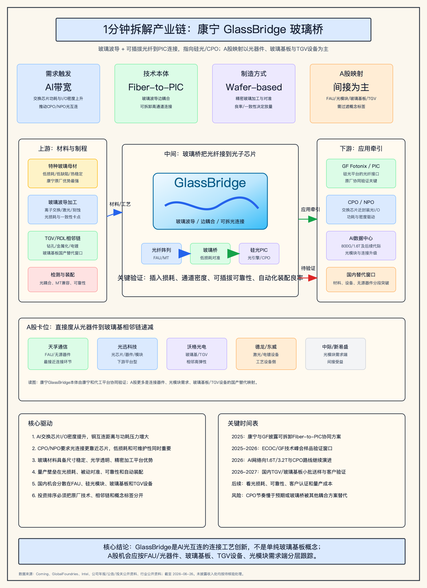

# 康宁GlassBridge玻璃桥技术上下游产业链与A股公司分析报告

> 分析日期：2026-06-26  
> 研究范围：康宁GlassBridge Fiber-to-PIC玻璃波导连接技术、硅光/CPO应用链，以及国内A股可映射的光器件、玻璃基板、TGV设备和光模块环节。  
> 分析口径：本文把“康宁玻璃桥技术”界定为面向PIC/硅光平台的玻璃波导可拆卸光纤连接方案；玻璃基板、TGV、RDL属于相邻先进封装链，不能直接等同于康宁GlassBridge本体。

## 0. 核心结论

1. 康宁GlassBridge的本质不是传统显示玻璃或普通玻璃基板，而是“特种玻璃材料 + 玻璃波导 + Fiber-to-PIC可拆连接 + 硅光/CPO平台验证”的光互连封装技术，核心价值在降低光纤到光子芯片的耦合、装配和维护难度。
2. 产业链最稀缺环节集中在玻璃波导设计与制造、边耦合/垂直耦合结构、被动对准、插入损耗控制、MT兼容接口和高通道可拆卸可靠性；这些环节当前主要由康宁和海外硅光平台协同推进。
3. A股没有明确的“康宁GlassBridge直接供应链”标的，映射应分层：天孚通信更接近FAU/无源光器件连接环节，光迅科技处在光芯片/器件/模块平台，沃格光电、德龙激光、东威科技等更多对应玻璃基板/TGV相邻工艺链，中际旭创、新易盛属于光模块需求端间接受益。
4. 投资机会的主线不是“所有玻璃基板公司”，而是AI数据中心光I/O密度提升推动CPO/NPO、硅光PIC、可插拔高密度光连接和玻璃基精密加工共同升级；真正兑现需要客户验证、批量良率、收入占比和成本曲线。
5. 最大风险是主题外延被泛化：玻璃盖板、显示玻璃、普通PCB、普通光模块都可能被市场贴上“玻璃桥/玻璃基/CPO”标签，但如果没有Fiber-to-PIC、TGV/RDL、硅光客户或FAU高端连接证据，只能列为间接或待验证概念。

## 1. 研究对象、边界与口径

| 项目 | 定义 |
| --- | --- |
| 分析对象 | 康宁GlassBridge Fiber-to-PIC玻璃波导可拆连接技术 |
| 纳入主线 | 特种玻璃母材、玻璃波导加工、光纤阵列/MT接口、PIC边耦合/垂直耦合、硅光平台、CPO/NPO光引擎 |
| 相邻链路 | 玻璃基板、TGV玻璃通孔、RDL金属化、电镀、激光加工、光模块与AI交换机 |
| 弱相关/排除 | 显示玻璃盖板、普通电子玻璃、无TGV或光连接证据的玻璃材料公司；仅有CPO概念但无光器件/硅光产品披露的公司 |
| 核心指标 | 插入损耗、偏振相关损耗、通道密度、可插拔次数、热/湿/机械可靠性、自动化装配良率、客户验证、收入占比 |
| A股映射口径 | 优先采用年报、公告、公司官网、投关问答和产品资料；若仅有行业会议或媒体信息，标注为中低置信或待核验 |

## 2. 行业背景与需求驱动

AI数据中心网络正在把光互连推向更靠近交换芯片和计算芯片的位置。传统可插拔光模块仍是主流，但随着SerDes速率、端口密度和功耗上升，CPO/NPO路线希望减少电互连距离，把光引擎放到封装附近。此时，如何把大量光纤稳定、低损耗、可维护地连接到PIC，成为从“光模块”走向“封装级光I/O”的关键工程问题。

康宁GlassBridge的技术位置就在这个连接缝隙：它用玻璃波导实现光纤到PIC的高密度连接，并强调可拆卸、平台兼容和规模化制造。玻璃基板/TGV产业链与它共享“精密玻璃加工、金属化、可靠性和面板/晶圆级制造”的方法论，但GlassBridge首先是光连接与硅光封装问题，不应被简化为玻璃基板概念。

| 驱动 | 方向 | 影响环节 | 传导逻辑 | 证据强度 |
| --- | --- | --- | --- | --- |
| AI数据中心带宽提升 | 正向 | 硅光PIC、CPO/NPO、光纤连接 | 交换容量上升 -> 光I/O靠近芯片 -> 高密度Fiber-to-PIC需求增加 | 高 |
| 可拆卸光连接需求 | 正向 | 玻璃波导连接器、FAU、MT接口 | CPO需要可维护性，连接器既要低损耗又要可插拔 | 高 |
| 玻璃精密加工平台化 | 正向 | 特种玻璃、玻璃基板、TGV、RDL | 玻璃尺寸稳定、平整度和光学特性支撑高密度互连 | 中高 |
| 国内CPO/硅光生态成熟 | 正向但分化 | 光芯片、无源器件、光模块 | 光模块厂和器件厂受益，但不等同于掌握玻璃桥核心工艺 | 中 |
| 替代路线竞争 | 负向/分化 | 光纤耦合、硅光封装 | 透镜阵列、聚合物波导、传统FAU、其他边耦合方案可能替代 | 中 |

## 3. 产业链全景图谱

| 环节 | 细分领域 | 角色 | 关键输入 | 关键输出 | 价值/成本驱动 | 代表A股公司 |
| --- | --- | --- | --- | --- | --- | --- |
| 上游材料 | 特种光学玻璃、低缺陷玻璃晶圆/片材 | 提供玻璃波导和精密载体基础 | 高纯硅砂/硼铝体系、熔融/成型/退火能力 | 低损耗、低缺陷、热稳定玻璃 | 材料配方、缺陷率、尺寸稳定性 | A股直接度弱；凯盛科技等需核验 |
| 上游制程 | 玻璃波导、激光/离子交换/刻蚀、对准标记 | 把玻璃加工成光连接结构 | 精密激光、光刻、湿法、测量 | 玻璃波导、V-groove/对准结构 | 插入损耗、良率、可靠性 | 德龙激光、芯碁微装、东威科技相邻映射 |
| 中游连接 | GlassBridge、FAU、MT兼容接口 | 连接光纤阵列和PIC | 光纤阵列、玻璃桥、封装装配 | 可拆卸Fiber-to-PIC连接器 | 低损耗、通道密度、可维护性 | 天孚通信、太辰光等待核验 |
| 中游平台 | GF Fotonix、硅光PIC、光引擎 | 承接光I/O功能 | PIC、驱动/TIA、封装基板、散热 | 硅光光引擎、CPO/NPO组件 | 平台验证、客户生态、代工能力 | 光迅科技、源杰科技、仕佳光子等相邻 |
| 下游系统 | CPO/NPO交换机、AI数据中心网络 | 形成需求拉动 | 光引擎、交换芯片、板卡、光纤 | 高带宽低功耗互连系统 | 交换芯片代际、云厂商Capex | 中际旭创、新易盛等间接受益 |

## 4. 上游材料、部件与制程要素挖掘

| 上游层级 | 细分材料/部件 | 对目标产业的作用 | 价值/稀缺性 | 卡脖子程度 | A股候选 | 纳入主线判断 |
| --- | --- | --- | --- | --- | --- | --- |
| Product BOM | 玻璃波导桥、FAU、MT接口、PIC边耦合区 | 构成Fiber-to-PIC连接的核心物理结构 | 高；直接决定损耗、通道密度和可维护性 | High | 天孚通信、太辰光、光库科技待核验 | Core/Important |
| Manufacturing Process | 玻璃波导写入、离子交换、激光诱导、湿法刻蚀、被动对准 | 决定玻璃桥能否规模制造 | 高；工艺窗口窄，和康宁玻璃材料强绑定 | High | 德龙激光、芯碁微装、沃格光电待核验 | Core/Adjacent |
| Board/package materials | 玻璃基板、TGV、RDL、金属化、电镀、介电/粘接材料 | 支撑先进封装和玻璃基相邻链 | 中高；对CPO封装和玻璃载板有协同 | Medium/High | 沃格光电、东威科技、三孚新科待核验 | Important/Adjacent |
| Resource/feedstock | 高纯石英砂、硼/铝/碱金属体系、光纤预制棒材料 | 支撑特种玻璃和光纤材料 | 中；康宁原厂控制力强，A股替代证据弱 | Medium | 凯盛科技、中国巨石等需核验 | Adjacent/待验证 |
| Adjacent infrastructure | 硅光PIC、光模块、CPO交换机、AI网络 | 形成终端需求而非玻璃桥本体 | 高；决定放量节奏 | Medium | 光迅科技、中际旭创、新易盛、源杰科技 | Adjacent/Important |

五层扫描结论：康宁GlassBridge的核心上游不是普通玻璃原片，而是可实现低损耗玻璃波导和高精度对准的材料-工艺组合；国内A股可挖掘机会集中在FAU/无源光器件、玻璃基/TGV加工、激光/电镀/曝光设备和光模块需求侧。若企业只披露显示玻璃或泛电子玻璃，不能直接纳入主线。

## 5. 产业链核心环节价值分布

| 产业链环节 | 细分领域/关键产品 | BOM成本占比/价值占比 | 核心技术壁垒 | 卡脖子程度 | 代表A股公司 | 公司环节地位 | 证据口径/备注 |
| --- | --- | --- | --- | --- | --- | --- | --- |
| 核心连接 | GlassBridge玻璃波导连接器、Fiber-to-PIC | 定性高；决定CPO可维护性和连接良率 | 低损耗波导、被动对准、MT兼容、可插拔可靠性 | High | 天孚通信等仅为相邻连接映射 | 海外原厂核心，A股间接 | 康宁/GF公开资料，A股无直接GlassBridge收入披露 |
| 硅光平台 | PIC、光引擎、边耦合/垂直耦合 | 定性高；决定连接器导入机会 | 硅光工艺、封装平台、客户生态 | High | 光迅科技、源杰科技、仕佳光子 | 国内相邻/挑战者 | 需核验CPO/PIC客户和收入 |
| 玻璃基先进封装 | 玻璃基板、TGV、RDL、金属化 | 中高；更多属于相邻玻璃基封装主线 | 玻璃通孔、孔金属化、翘曲控制、RDL线宽线距 | Medium/High | 沃格光电、东威科技、德龙激光、芯碁微装 | 重要配套/高弹性 | 与GlassBridge共享玻璃加工逻辑，但不是同一产品 |
| 光纤无源器件 | FAU、透镜阵列、微光学组件 | 中高；连接装配关键 | 端面加工、阵列精度、耦合效率、批量一致性 | Medium/High | 天孚通信、太辰光、光库科技 | 重要配套 | 更接近Fiber-to-PIC连接，但具体GlassBridge客户未披露 |
| 光模块/系统 | 800G/1.6T、CPO/NPO交换机 | 中；需求牵引强但不掌握玻璃桥 | 模块设计、硅光/EML路线、客户认证 | Medium | 中际旭创、新易盛、光迅科技 | 间接受益/下游龙头 | 受AI光互连景气影响，GlassBridge只是潜在路线之一 |

价值集中在两个位置：一是康宁原厂控制的玻璃材料、波导和可拆连接结构，二是硅光平台和CPO系统对连接方案的认证。A股若要兑现，需要证明自己处在“连接器件、玻璃基封装工艺或光模块需求”中的哪一层，并披露收入、客户或订单，而不是只使用玻璃基或CPO概念。

## 6. 竞争格局与核心壁垒

| 环节/细分 | 全球领导者/参考体系 | 中国/A股映射 | 壁垒类型 | 国产化状态 | 核心瓶颈 |
| --- | --- | --- | --- | --- | --- |
| 玻璃波导连接器 | Corning GlassBridge、GF Fotonix协同 | 暂无直接等价A股披露 | 材料、波导、对准、可靠性、平台认证 | 早期跟踪 | 原厂材料和硅光平台绑定 |
| 硅光PIC/光引擎 | GF、台积电/Intel/Broadcom等生态 | 光迅科技、源杰科技、仕佳光子等 | 硅光工艺、良率、客户认证 | 国产替代推进 | 高端客户和规模交付 |
| 玻璃基板/TGV | Intel、康宁/海外玻璃材料与设备生态 | 沃格光电、德龙激光、东威科技、芯碁微装 | TGV、RDL、金属化、翘曲控制 | 小批验证/导入期 | 良率、成本、客户量产 |
| 无源光连接 | US Conec、康宁、精密光器件厂 | 天孚通信、太辰光、光库科技 | 精密加工、微光学、批量一致性 | 国内较强但高端仍需验证 | CPO/PIC场景认证 |
| 光模块与系统 | Coherent、Broadcom、Marvell及全球模块厂 | 中际旭创、新易盛、光迅科技 | 高速设计、客户份额、供应链协同 | 国内龙头强 | CPO节奏和路线选择 |

竞争的核心不在“谁会做玻璃”，而在谁能把玻璃材料变成稳定低损耗的光连接接口，并进入硅光平台和AI网络客户的验证体系。玻璃基板/TGV是另一个可能受益的相邻主线，但它的价值验证更多来自先进封装客户的量产导入。

## 7. A股公司映射与核心地位判断

| 公司 | 代码 | 环节 | 细分领域 | 产业占比/暴露度 | 核心技术/产品 | 卡脖子相关性 | 环节地位 | 证据与备注 |
| --- | --- | --- | --- | --- | --- | --- | --- | --- |
| 天孚通信 | 300394 | 中游连接 | FAU、无源光器件、微光学、光引擎配套 | 未披露GlassBridge直接收入；光通信器件为主营 | FAU无源器件、微光学平台、高速光引擎解决方案 | Medium/High | 重要配套/最接近连接环节 | 年报披露FAU、微光学和光引擎相关解决方案；是否供应用于玻璃桥需核验 |
| 光迅科技 | 002281 | 硅光/光器件/模块 | 光芯片、器件、模块和子系统 | 未披露GlassBridge直接收入；主营为光电子器件模块 | 光芯片、光器件、数据通信光模块 | Medium | 下游平台型/相邻核心 | 年报披露光电子器件、模块和子系统，应用于电信和数据中心网络 |
| 沃格光电 | 603773 | 玻璃基相邻链 | TGV、玻璃基电路板、玻璃基先进封装 | 未披露；部分产品处送样/小批阶段 | TGV精密通孔玻璃基板、GCP玻璃基电路板 | Medium/High | 关键技术挑战者/高弹性 | 公开资料显示TGV/玻璃基产品送样和验证，但不能等同康宁GlassBridge |
| 德龙激光 | 688170 | 制程设备 | TGV激光诱导、玻璃基板激光加工 | 公司提示相关业务占比小 | TGV激光加工设备、湿法试验线协同 | Medium | 重要设备配套 | 投关资料称TGV工艺深耕多年并形成销售，但收入占比较小 |
| 东威科技 | 688700 | 制程设备 | TGV/RDL电镀、金属化设备 | 未披露；玻璃基板设备仍需核验订单 | 水平/垂直连续电镀、Via Filling | Medium | 重要设备配套/待验证 | 行业资料显示布局TGV电镀填孔方案，需核验正式订单和收入 |
| 芯碁微装 | 688630 | 制程设备 | 直写光刻、先进封装RDL/载板曝光 | 未披露GlassBridge直接收入 | 直写光刻设备、IC载板/先进封装曝光 | Low/Medium | 相邻设备 | 可映射RDL/玻璃基板图形化，直接度低于TGV设备 |
| 中际旭创 | 300308 | 下游应用 | 高速光模块、AI数据中心光互连 | 未披露GlassBridge直接收入；光模块主营 | 800G/1.6T高速光模块 | Medium | 下游龙头/间接受益 | 需求端受AI光互连景气影响，但不掌握玻璃桥核心 |
| 新易盛 | 300502 | 下游应用 | 高速光模块、数据中心互连 | 未披露GlassBridge直接收入 | 高速光模块、硅光相关产品待核验 | Medium | 下游龙头/间接受益 | 与CPO/硅光趋势相关，需区分模块需求和玻璃桥技术 |
| 凯盛科技 | 600552 | 上游材料待验证 | 特种玻璃/电子玻璃 | 待核验 | 电子玻璃、显示/盖板等材料 | Low | 待验证概念 | 若无光波导玻璃、玻璃基板或TGV客户证据，不纳入核心 |

从直接度看，A股最值得优先跟踪的是“连接器件”和“玻璃基/TGV设备”两类，而不是泛玻璃材料。天孚通信接近Fiber-to-PIC连接配套，但仍需证明其产品进入CPO/PIC新连接方案；沃格光电、德龙激光、东威科技是玻璃基先进封装相邻链，高弹性来自TGV/玻璃基量产验证，而非康宁GlassBridge直接订单。

## 8. 投资线索、交易跟踪与目标价情景

| 机会类型 | 产业链逻辑 | 代表A股公司 | 验证里程碑 | 风险 |
| --- | --- | --- | --- | --- |
| 核心环节龙头 | Fiber-to-PIC连接需要FAU、微光学和高精度无源器件配合 | 天孚通信 | CPO/PIC客户认证、FAU/微光学收入增速、海外大客户订单 | 只受益传统光模块，无玻璃桥或CPO新连接收入 |
| 关键技术突破者 | 玻璃基板/TGV可能承接CPO和先进封装的玻璃材料升级 | 沃格光电 | TGV量产线良率、客户验证、送样转订单、收入占比 | 产品仍处验证期，短期亏损或营收小 |
| 重要配套/高弹性 | TGV和玻璃基板需要激光诱导、湿法、电镀和曝光设备 | 德龙激光、东威科技、芯碁微装 | 设备订单、客户扩产、工艺指标、收入确认 | 设备订单低频、行业放量节奏慢 |
| 相邻基础设施 | AI光互连需求推动光芯片、光模块和硅光平台升级 | 光迅科技、中际旭创、新易盛、源杰科技 | 800G/1.6T出货、硅光/CPO产品验证、客户份额 | 光模块景气与GlassBridge技术路线不完全绑定 |
| 待验证概念 | 泛玻璃、显示玻璃、普通电子材料被贴上玻璃桥标签 | 凯盛科技等需核验公司 | 披露光波导玻璃、TGV玻璃基板、硅光客户或订单 | 仅概念关联，无法转化为业绩 |

本报告不输出买点、目标价和止损区间，因为当前任务是产业链报告而非交易跟踪。若后续进入交易附加分析，应先以天孚通信、沃格光电、德龙激光、东威科技、光迅科技为候选，补充最新价格、估值、成交量、机构趋势评分和收入占比；未达到趋势门槛或公司暴露弱的标的只放入观察名单。

## 9. 催化因素与产业传导路径

| 催化因素 | 方向 | 影响环节 | 传导路径 | 受影响A股公司 | 证据强度 | 时间维度 |
| --- | --- | --- | --- | --- | --- | --- |
| 康宁/GF样品展示和平台验证推进 | 正向 | 玻璃桥、硅光PIC、CPO连接 | 原厂技术验证 -> 平台接受度提升 -> 国内相邻链关注升温 | 天孚通信、光迅科技、沃格光电 | 高 | 短中期 |
| AI交换机向1.6T/3.2T与CPO演进 | 正向 | 光引擎、FAU、光模块 | 端口带宽提升 -> 光I/O密度提高 -> 高端连接和硅光需求增加 | 天孚通信、中际旭创、新易盛、光迅科技 | 中高 | 中长期 |
| 国内玻璃基/TGV客户验证 | 正向 | 玻璃基板、TGV、设备 | 送样 -> 小批 -> 量产订单 -> 设备和材料收入兑现 | 沃格光电、德龙激光、东威科技 | 中 | 中期 |
| 传统可插拔模块继续主导 | 负向/分化 | CPO/玻璃桥 | CPO节奏延后 -> 玻璃桥导入慢 -> 主题估值回落 | 玻璃基/TGV主题公司 | 中 | 短中期 |
| 替代耦合路线成熟 | 负向 | 玻璃桥连接器 | 透镜阵列/聚合物波导/传统FAU路线胜出 -> 玻璃桥份额受限 | 连接器件和玻璃基主题公司 | 中 | 中长期 |

## 10. 风险提示

1. 康宁GlassBridge仍处平台协同展示和客户验证阶段，距离大规模量产、定价和利润分配仍有不确定性。
2. A股公司多为相邻映射，尚无明确公开证据显示其进入康宁GlassBridge直接供应链。
3. CPO/NPO导入节奏若慢于市场预期，玻璃波导连接和玻璃基先进封装的收入兑现会后移。
4. 玻璃基板/TGV与GlassBridge存在工艺交叉，但产品逻辑不同，不能用TGV订单直接推导玻璃桥订单。
5. 高速光模块公司受AI光互连需求拉动，但其增长不一定来自玻璃桥技术路线。
6. 泛玻璃材料、显示玻璃和普通PCB公司容易被概念外延带动，若缺少客户和收入验证，估值回撤风险高。

## 11. 数据来源、证据强度与待核验事项

| 结论/数据 | 来源 | 日期 | 置信度 |
| --- | --- | --- | --- |
| GlassBridge是康宁面向Fiber-to-PIC的玻璃波导连接平台，强调晶圆级制造、TMT兼容和可拆卸高通道连接 | Corning GlassBridge产品页/搜索摘要 | 2026访问 | High |
| 康宁与GlobalFoundries协同开发面向GF Fotonix硅光平台的可拆卸光纤连接解决方案，并计划在ECOC/GF技术峰会展示 | GlobalFoundries/GlobeNewswire公开稿 | 2025-09-29 | High |
| 玻璃基板被Intel等视为先进封装下一代互连载体之一，优势包括尺寸稳定、平整度和高密度互连潜力 | Intel玻璃基板先进封装公开资料 | 2023-2026访问 | High |
| 天孚通信主营高速光器件，并披露FAU无源光器件、微光学和高速光引擎相关解决方案 | 天孚通信年度报告/公开公告 | 2025-2026 | High |
| 光迅科技主营光电子器件、模块和子系统，产品应用于电信和数据中心网络 | 光迅科技年度报告摘要/公开公告 | 2025-2026 | High |
| 沃格光电/通格微披露玻璃基电路板、TGV精密通孔玻璃基板等产品，部分仍处送样验证和小规模阶段 | 公司公开资料、行业报道 | 2025-2026 | Medium |
| 德龙激光披露TGV玻璃通孔相关设备和试验线，但相关业务收入占比较小 | 互动易/投关公开资料 | 2025-2026 | Medium |
| 东威科技布局TGV/RDL电镀和Via Filling相关设备方案，正式订单与收入仍需核验 | 行业会议资料/公开报道 | 2025-2026 | Medium |
| 国内CPO/玻璃基/TGV主题与康宁GlassBridge存在技术相邻关系，但不能视作直接供应链 | 产业链逻辑推导与公司披露交叉验证 | 2026-06-26 | Medium |

待核验事项：

1. 康宁GlassBridge的量产时间、客户名单、插入损耗、可靠性、通道密度和定价口径。
2. GF Fotonix平台是否把GlassBridge纳入标准化封装流程，以及是否有云厂商或交换芯片客户导入。
3. 天孚通信、太辰光、光库科技等是否有CPO/PIC场景下的FAU、MT接口或玻璃桥相邻连接产品订单。
4. 沃格光电TGV/玻璃基板从送样验证到量产收入的节奏、良率、客户和毛利率。
5. 德龙激光、东威科技、芯碁微装在玻璃基板/TGV/RDL设备中的订单规模和收入占比。
6. 光模块龙头的增长中有多少来自传统可插拔模块，多少来自硅光/CPO/封装级光I/O，避免把需求端景气误归因为玻璃桥。
