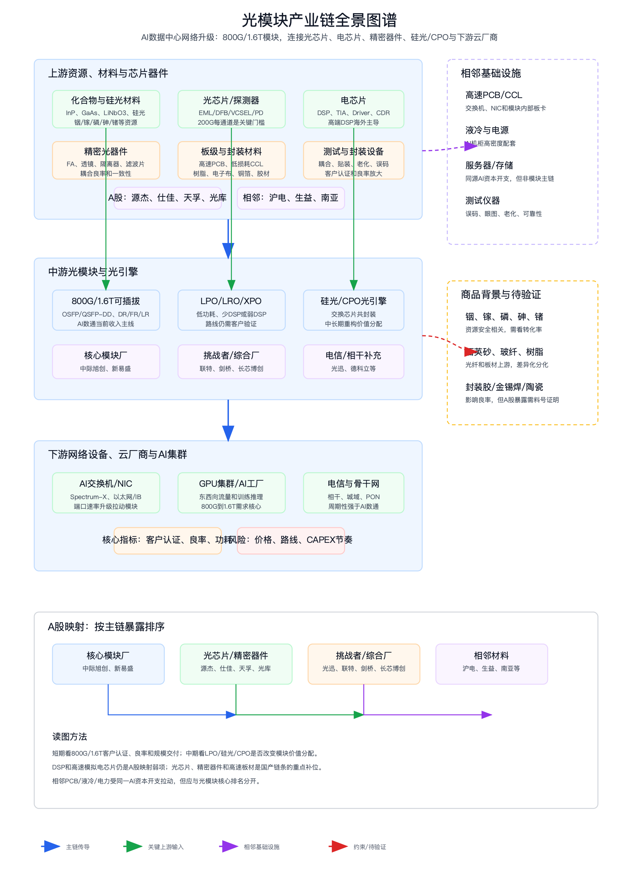

# 光模块上下游产业链与A股公司分析报告

> 分析日期：2026-06-24  
> 研究范围：全球AI数据中心光模块产业链；A股映射覆盖主板、科创板、创业板相关公司。  
> 分析口径：以800G/1.6T数通光模块为主线，兼顾硅光、CPO、LPO/LRO、上游光芯片/电芯片/精密器件/材料和电信相干模块。

## 0. 核心结论

1. 光模块的核心价值来自AI集群东西向流量爆发和端口速率升级，当前主线从800G向1.6T迁移，直接受益机会集中在高端数通光模块、精密光器件和高端光芯片。
2. 产业链瓶颈不是简单“模块组装”，而是DSP/TIA/Driver等高速电芯片、200G/lane光芯片、硅光/CPO封装、耦合良率、客户认证和规模交付。高端DSP仍主要由海外厂商掌握，是A股直接映射最弱的核心卡点。
3. A股映射可分四层：中际旭创、新易盛是核心模块龙头；天孚通信、源杰科技、仕佳光子、光库科技是上游器件/光芯片关键环节；光迅科技、联特科技、剑桥科技、长芯博创、德科立是综合/挑战者；沪电股份、生益科技等属于相邻高速PCB/材料链。
4. 上游材料需要拆到InP、GaAs、薄膜铌酸锂、铟/镓/磷/砷/锗、石英砂、FA/透镜/隔离器、陶瓷、封装胶、金锡焊、测试老化设备、高速PCB、低损耗CCL、电子布、树脂和铜箔。资源材料多是重要背景，只有进入高端料号和客户认证后才构成核心投资线索。
5. 投资弹性来自“终端需求扩张 + 核心输入短缺 + 技术路线重构”。短期看800G/1.6T订单和良率，长期看硅光、LPO/CPO、3.2T路线对传统可插拔模块、光芯片、DSP和交换机厂之间的价值再分配；主要风险是云厂商CAPEX节奏、价格下行和技术路线不确定。

## 1. 研究对象、边界与口径

| 项目 | 定义 |
| --- | --- |
| 分析对象 | 光模块产业链，重点为AI数据中心高速数通光模块 |
| 纳入主线 | 光芯片、电芯片、精密光器件、封装/测试、800G/1.6T可插拔模块、LPO/LRO、硅光/CPO、AI交换机/NIC、云厂商 |
| 相邻链路 | 高速PCB、低损耗CCL、服务器液冷、电源、光纤光缆、测试仪器、IDC基础设施 |
| 弱相关/排除 | 仅有光通信概念但无产品/主营证据的公司；普通低速光模块、普通低端PCB和无AI数通验证的材料公司不纳入核心排序 |
| 核心指标 | 800G/1.6T出货、客户认证、200G/lane能力、DSP供应、模块功耗、良率、毛利率、云厂商CAPEX |
| A股映射口径 | 主营/产品能力/年报公告/行情快照优先；AI数通占比未披露时标注“未披露；仅确认业务涉及” |

## 2. 行业背景与需求驱动

AI训练和推理集群让东西向网络流量显著提升，交换机、NIC和GPU集群端口速率升级成为光模块需求的核心牵引。1.6T模块从200G/lane、低功耗DSP、光芯片良率和封装耦合能力上提出更高要求；同时，硅光/CPO试图把光互连更靠近交换芯片，长期可能改变传统可插拔光模块的价值分配。

| 驱动 | 方向 | 影响环节 | 传导逻辑 | 证据强度 |
| --- | --- | --- | --- | --- |
| AI factory和GPU集群扩张 | 正向 | 800G/1.6T模块、光芯片、精密器件 | GPU集群规模扩大，东西向流量增长，推动高速端口和光模块需求 | 高 |
| 1.6T与200G/lane升级 | 正向 | DSP、光芯片、模块封装 | 单通道速率提升带来低功耗、误码率和封装良率压力 | 高 |
| 硅光/CPO推进 | 双向 | 硅光芯片、光引擎、传统模块 | 光电共封装可能降低功耗并改变模块形态，重构价值分配 | 中高 |
| LPO/LRO/XPO路线 | 分化 | DSP、模块厂、客户认证 | 减少或弱化DSP可能降低成本/功耗，但对系统级调试要求更高 | 中 |
| 电信资本开支周期 | 中性/周期 | 相干、电信光模块、PON | 运营商招标和库存周期影响传统光通信需求，与AI数通弹性不同 | 中 |

## 3. 产业链全景图谱

| 环节 | 细分领域 | 角色 | 关键输入 | 关键输出 | 价值/成本驱动 | 代表A股公司 |
| --- | --- | --- | --- | --- | --- | --- |
| 上游资源/材料 | 铟、镓、砷、磷、锗、石英砂、电子级树脂、电子布、铜箔 | 支撑InP/GaAs/硅光、光纤玻璃和高速板材 | 化合物半导体材料、玻纤、树脂、铜箔 | 外延片、光纤、低损耗CCL | 资源安全、纯度、低损耗、客户认证 | 云南锗业等资源候选；生益科技、沪电股份等相邻 |
| 上游芯片 | EML/DFB/VCSEL、PD、硅光、DSP、TIA、Driver | 决定速率、功耗、误码率和国产替代空间 | 外延片、晶圆制造、封装材料 | 光芯片、电芯片 | 200G/lane、低功耗、良率 | 源杰科技、仕佳光子；DSP直接A股标的弱 |
| 上游器件 | FA、透镜、隔离器、滤波片、WDM、陶瓷插芯 | 决定耦合效率、可靠性和规模交付 | 光学材料、精密加工、测试设备 | 精密光器件/组件 | 客户认证、精度、一致性 | 天孚通信、太辰光、光库科技 |
| 中游模块 | 400G/800G/1.6T、LPO/LRO、相干、硅光模块 | 把芯片和器件集成为客户可部署模块 | 光芯片、电芯片、器件、PCB | 数通/电信光模块 | 良率、交付规模、客户认证、价格曲线 | 中际旭创、新易盛、联特科技、剑桥科技、长芯博创 |
| 下游数通 | AI数据中心、云厂商、交换机/NIC、GPU集群 | 形成高速端口需求 | 交换机、NIC、GPU、服务器、电力 | AI网络互连 | CAPEX、端口速率、网络架构 | A股多映射到上游供应 |
| 下游电信 | 骨干网、城域网、PON、5G/6G | 传统需求，周期性和招标属性更强 | 传输设备、运营商投资 | 电信光模块/器件 | 运营商招标、库存周期 | 光迅科技、德科立等 |

光模块主链应按“材料/芯片/器件 -> 模块/光引擎 -> AI交换机/云厂商”阅读。高速PCB、液冷、电力和服务器是相邻基础设施，受同一AI资本开支驱动，但不应替代光模块主链排序。

## 4. 上游材料、部件与制程要素挖掘

| 上游层级 | 细分材料/部件 | 对目标产业的作用 | 价值/稀缺性 | 卡脖子程度 | A股候选 | 纳入主线判断 |
| --- | --- | --- | --- | --- | --- | --- |
| Product BOM | 光芯片、探测器、DSP、TIA、Driver、CDR | 构成光电转换和高速电信号处理核心，决定速率、功耗和误码率 | 高；DSP和高端模拟芯片海外主导，光芯片国产替代推进 | High | 源杰科技、仕佳光子、光迅科技；DSP直接A股标的弱 | Core |
| Product BOM | FA、透镜、隔离器、滤波片、陶瓷插芯、WDM器件 | 影响耦合效率、良率和交付规模 | 中高；精密加工和客户认证壁垒强 | Medium/High | 天孚通信、太辰光、光库科技 | Important/Core upstream |
| Manufacturing Process | 外延、耦合贴装、金锡焊、封装胶、UV胶、老化测试、误码测试 | 决定芯片/器件封装良率和长期可靠性 | 高；工艺窗口和测试能力稀缺 | High | 待验证；部分设备/材料公司需按料号核验 | Important/待验证 |
| Board/package materials | 高速PCB、低损耗CCL、BT/ABF基板、陶瓷基板、树脂、电子布、铜箔 | 支撑模块内部高速电互连、交换机/NIC板卡和热可靠性 | 中高；高速低损耗材料认证周期长 | Medium | 沪电股份、生益科技、南亚新材等 | Important/Adjacent |
| Resource/feedstock | 铟、镓、砷、磷、锗、石英砂、稀土、电子级树脂原料 | 传导到InP/GaAs、光纤玻璃、透镜和高速板材成本 | 分化；更多体现资源安全和价格周期 | Medium/Low | 云南锗业、兴发集团等需按材料链路核验 | Commodity/Important |
| Adjacent infrastructure | 交换机、NIC、液冷、电源、服务器、测试仪器 | AI集群规模扩大带动高速端口、测试和机房配套 | 高，但属于相邻链路 | Medium | 沪电股份、生益科技、英维克、科华数据等 | Adjacent |

五层扫描结论：Product BOM中DSP、光芯片、探测器、TIA/Driver和精密器件是核心；Process materials中封装胶、金锡焊、老化测试耗材决定良率和可靠性；Board/package materials中高速PCB、低损耗CCL、树脂、电子布和铜箔是重要配套；Resource/feedstock中铟、镓、磷、砷、锗和石英砂更多体现资源安全与价格周期；Adjacent infrastructure应单列。

## 5. 产业链核心环节价值分布

| 产业链环节 | 细分领域/关键产品 | BOM成本占比/价值占比 | 核心技术壁垒 | 卡脖子程度 | 代表A股公司 | 公司环节地位 | 证据口径/备注 |
| --- | --- | --- | --- | --- | --- | --- | --- |
| 上游电芯片 | DSP、TIA、Driver、CDR、SerDes | 定性高；1.6T方案中是核心价值池 | 先进制程、高速模拟/混合信号、低功耗、信号完整性 | High | A股直接弱；澜起科技为相邻互连芯片映射 | 待验证/间接 | 高端DSP主要海外主导，A股不宜硬映射 |
| 上游光芯片 | EML、DFB、VCSEL、InP/硅光、探测器 | 高；光源和调制决定速率、功耗和良率 | 外延、芯片设计、200G/lane、耦合封装、客户认证 | High | 源杰科技、仕佳光子、光迅科技 | 关键技术突破者 | 主营直接覆盖光芯片/器件，高端料号需客户验证 |
| 上游精密器件 | FA、透镜、隔离器、滤波片、陶瓷插芯 | 中高；高速升级提升良率和封装价值 | 精密加工、耦合效率、一致性、可靠性 | Medium/High | 天孚通信、太辰光、光库科技 | 重要配套/高弹性 | 主营核验为光器件，具体AI数通占比未披露 |
| 中游模块 | 800G/1.6T可插拔模块、LPO、相干模块 | 收入核心；毛利取决于客户认证、良率和价格曲线 | 高速封装、热设计、低功耗、规模交付、客户认证 | Medium | 中际旭创、新易盛、联特科技、剑桥科技、长芯博创 | 核心环节龙头/挑战者 | 主营业务直接覆盖光模块，AI数通精确占比待披露 |
| 下一代路线 | 硅光、CPO、XPO、3.2T方向 | 中长期高；可能重构可插拔模块价值分配 | 光电共封装、热管理、系统协同、良率、生态合作 | High | 光迅科技、光库科技、源杰科技、中际旭创 | 关键技术突破者/观察名单 | 路线确定性仍需客户量产验证 |
| 相邻基础设施 | AI交换机、NIC、高速PCB、低损耗CCL、液冷、电源 | 非光模块本体；对AI网络CAPEX有高弹性 | 高速信号完整性、材料低损耗、散热和工程交付 | Medium | 沪电股份、生益科技、英维克、科华数据 | 相邻核心材料/配套 | 与光模块主链分开，不作为光模块核心排序 |

价值分布的核心判断是：A股最直接的收入弹性在中游800G/1.6T模块，但真正的卡点在上游电芯片和高端光芯片；精密器件、封装和测试决定良率与交付能力；硅光/CPO属于中长期路线，可能让模块厂、光芯片厂、交换机厂和系统厂之间的价值重新分配。

## 6. 竞争格局与核心壁垒

| 环节/细分 | 全球领导者/参考体系 | 中国/A股映射 | 壁垒类型 | 国产化状态 | 核心瓶颈 |
| --- | --- | --- | --- | --- | --- |
| 高速数通模块 | Coherent、Lumentum、Fabrinet等海外链条与头部云客户认证体系 | 中际旭创、新易盛 | 客户认证、规模交付、良率、热设计 | A股模块厂全球竞争力强 | 价格竞争和客户集中 |
| DSP/TIA/Driver | Marvell、Broadcom等 | A股直接弱 | 先进制程、高速模拟、功耗、生态 | 国产化薄弱 | 高端DSP供应与路线依赖 |
| 光芯片/硅光 | Lumentum、Coherent、Intel硅光等 | 源杰科技、仕佳光子、光迅科技 | 外延、200G/lane、耦合封装 | 部分突破 | 高端料号客户验证 |
| 精密器件 | 海外精密光器件厂商 | 天孚通信、太辰光、光库科技 | 精密加工、可靠性、一致性 | 国产企业竞争力较强 | 客户认证和产能爬坡 |
| 高速板材/PCB | 高端PCB/材料全球供应链 | 沪电股份、生益科技、南亚新材 | 信号完整性、低损耗材料、认证周期 | 国产龙头强化 | 与光模块主链直接度低一层 |

竞争格局呈现“模块龙头全球化、上游芯片补短板、器件材料分化、下一代路线未定”的结构。中际旭创和新易盛更接近收入兑现主线；源杰科技、仕佳光子承担国产光芯片突破弹性；天孚通信和光库科技受益于精密器件和封装良率；沪电股份、生益科技是相邻高速板材链，需与光模块核心链区分。

## 7. A股公司映射与核心地位判断

| 公司 | 代码 | 环节 | 细分领域 | 产业占比/暴露度 | 核心技术/产品 | 卡脖子相关性 | 环节地位 | 证据与备注 |
| --- | --- | --- | --- | --- | --- | --- | --- | --- |
| 中际旭创 | 300308 | 中游模块 | 高端光通信收发模块、光组件 | 未披露；主营为高端光通信收发模块，行情快照显示通信设备龙头 | 光通信收发模块、光组件、汽车光电子 | Medium | 核心环节龙头 | 主营直接覆盖高端光模块，AI数通直接度最高之一 |
| 新易盛 | 300502 | 中游模块 | 全系列光通信应用光模块 | 未披露；主营为全系列光模块研发生产销售 | 光互联产品、高速光模块 | Medium | 核心环节龙头 | 与中际旭创同属主链模块龙头，收入弹性直接 |
| 天孚通信 | 300394 | 上游器件 | 高速光器件与封装解决方案 | 未披露；主营为高速光器件规模量产销售 | 精密微光学组件、WDM、封装、ELS | Medium/High | 重要配套/高弹性 | 精密器件和封装能力直接影响模块良率 |
| 源杰科技 | 688498 | 上游芯片 | 光芯片 | 未披露；主营为光芯片研发设计生产销售 | 光芯片、半导体材料和器件 | High | 关键技术突破者 | 直接对应光芯片国产替代，高端料号仍需验证 |
| 仕佳光子 | 688313 | 上游芯片/器件 | 光芯片及器件、室内光缆和线缆材料 | 未披露；主营含光芯片及器件 | 光集成芯片、光电芯片、器件、模块 | High | 关键技术突破者 | 产品链覆盖芯片到器件，客户和高端占比需核验 |
| 光库科技 | 300620 | 上游器件 | 光通信器件、激光雷达光源模块 | 未披露；主营含隔离器、波分复用器、光纤透镜等 | 隔离器、MEMS Switch、WDM、光纤透镜 | Medium | 重要配套 | 精密光器件链条直接相关，估值对成长敏感 |
| 光迅科技 | 002281 | 综合厂 | 光电子器件、模块和子系统 | 未披露；主营覆盖传输、接入、数据通信产品 | 光电子器件、模块、子系统 | Medium/High | 综合龙头/挑战者 | 覆盖电信和数通，AI数通弹性需分拆 |
| 联特科技 | 301205 | 中游模块 | 400G及以上光模块 | 未披露；主营产品明确分为400G及以上和400G以下光模块 | 400G及以上光模块、400G以下光模块 | Medium | 关键挑战者 | 直接处在高速模块主线，但规模和盈利稳定性需观察 |
| 剑桥科技 | 603083 | 中游模块/终端设备 | 高速光模块、电信宽带、无线网络与边缘计算 | 未披露；主营含高速光模块 | 高速光模块、终端设备 | Medium | 高弹性挑战者 | 当日涨停且换手高，需防主题交易过热 |
| 长芯博创 | 300548 | 芯片/模块 | 集成光电子器件、光模块、AOC、铜缆 | 未披露；主营覆盖光电芯片、模组、光模块 | 光电芯片、光电模组、AOC、DAC/ACC/AEC | Medium/High | 关键挑战者 | 产品覆盖较全，需核验AI数通客户和占比 |
| 太辰光 | 300570 | 上游器件 | 光互联元件、连接器、PLC/AWG、AOC | 未披露；主营为光通信器件及集成功能模块 | 陶瓷插芯、MT插芯、光模块配套产品 | Medium | 重要配套 | 精密连接器/器件受益，直接高速模块占比需验证 |
| 德科立 | 688205 | 光器件/子系统 | 光电子器件、子系统、光模块 | 未披露；主营为光电子器件研发生产销售 | 光模块、子系统、高速光电收发芯片 | Medium | 重要配套/挑战者 | 直接相关但规模较小，需看客户与产品代际 |
| 沪电股份 | 002463 | 相邻材料/PCB | 高速PCB | 未披露；主营为印制电路板 | 多层板、HDI、PCB | Low/Medium | 相邻核心材料 | AI交换机/服务器板材受益，不是光模块本体 |
| 生益科技 | 600183 | 相邻材料 | 覆铜板、粘结片、PCB、电子级玻璃布、树脂、铜箔 | 未披露；主营覆盖覆铜板和粘结片 | 低损耗CCL、粘结片、电子级玻璃布、树脂 | Low/Medium | 相邻核心材料 | 上游板材价值高，但与光模块主链隔一层 |

主链排序上，中际旭创、新易盛最直接；天孚通信、源杰科技、仕佳光子、光库科技是上游高价值环节；光迅科技、联特科技、剑桥科技、长芯博创属于综合/挑战者；沪电股份、生益科技虽受AI网络板材升级驱动，但应归为相邻基础设施材料。

## 8. 投资线索、交易跟踪与目标价情景

| 公司 | 代码 | 产业链结论 | 财务质量 | 当前估值 | 技术面/趋势 | 买点区间 | 止损/失效条件 | 目标价/空间 | 综合判断 |
| --- | --- | --- | --- | --- | --- | --- | --- | --- | --- |
| 中际旭创 | 300308 | 核心模块龙头，AI数通直接受益 | 毛利率约46.1%，净利率约32.4%，ROE约17.5% | 动态PE约63.8，PB约42.2，估值已反映龙头溢价 | 当日微涨约0.17%，成交额约344亿元，流动性极强 | 不追高，等缩量回踩核心均线或订单超预期确认 | 放量跌破趋势平台或云厂CAPEX下修 | 需以订单和盈利上修驱动 | 核心观察，基本面最硬但估值敏感 |
| 新易盛 | 300502 | 核心模块龙头，高速光模块弹性直接 | 毛利率约49.2%，净利率约33.3% | 动态PE约69.6，PB约39.9 | 当日上涨约0.6%，成交额约227亿元 | 等待回踩确认或1.6T订单催化 | 高位放量转弱、价格下行快于成本下降 | 空间来自1.6T份额和盈利扩张 | 核心观察 |
| 天孚通信 | 300394 | 精密器件/封装配套高弹性 | 毛利率约56.6%，净利率约37.0% | 动态PE约180，PB约64.9 | 当日上涨约4.57%，资金热度高 | 等待高换手后缩量回踩 | 客户认证或产能爬坡不及预期 | 高弹性但估值约束强 | 重要配套，偏趋势 |
| 源杰科技 | 688498 | 光芯片国产替代稀缺标的 | 毛利率约77.8%，净利率约50.5% | 动态PE约319，PB约92.8 | 当日上涨约1.08%，价格和估值波动极高 | 只适合等重大客户验证或回撤后观察 | 高端料号未放量或毛利回落 | 空间取决于高端光芯片突破 | 关键技术突破者，高风险高弹性 |
| 光迅科技 | 002281 | 光电子综合龙头，电信+数通并存 | 毛利率约26.8%，净利率约8.4% | 动态PE约229.7，PB约15.9 | 当日小跌约0.2%，成交活跃 | 等待数通产品验证更明确 | AI数通弹性低于预期 | 空间取决于高端数通/硅光进展 | 综合观察 |
| 剑桥科技 | 603083 | 高速光模块挑战者，交易热度高 | 毛利率约29.3%，净利率约7.6% | 动态PE约204，PB约12.9 | 当日涨停，换手约11.15%，短线过热 | 不追涨，等放量后回踩确认 | 主题退潮或业绩兑现不足 | 空间来自订单弹性但波动大 | 高弹性观察，风险更高 |

交易跟踪口径来自2026-06-24公开行情快照和主营业务采样，仅用于建立观察框架。若需要正式买点、目标价和止损，应进一步调用财报拆分、历史K线和一致预期数据；当前报告不把概念热度等同于买入建议。

## 9. 催化因素与产业传导路径

| 催化因素 | 影响链路 | 传导路径 | 受益公司 | 观察指标 |
| --- | --- | --- | --- | --- |
| 云厂商800G/1.6T采购上修 | 中游模块、上游器件 | AI集群端口增长 -> 模块订单 -> 组件/芯片拉货 | 中际旭创、新易盛、天孚通信、源杰科技 | 订单、交付、毛利率、客户库存 |
| 1.6T量产和200G/lane成熟 | DSP、光芯片、封装 | 速率升级 -> 高端光芯片和封装良率要求提升 | 源杰科技、仕佳光子、天孚通信、光库科技 | 高端料号认证、良率、产能 |
| 硅光/CPO路线推进 | 硅光、光引擎、交换机 | 光互连靠近交换芯片 -> 模块形态和价值重构 | 光迅科技、光库科技、源杰科技、中际旭创 | 样机、客户验证、量产时间表 |
| 高速PCB和低损耗材料升级 | 相邻板材/PCB | AI交换机/NIC复杂度提升 -> 低损耗板材需求 | 沪电股份、生益科技、南亚新材 | 交换机订单、低损耗CCL占比 |
| 电信资本开支回暖 | 电信模块/相干 | 运营商招标和库存修复 -> 电信链条需求改善 | 光迅科技、德科立、太辰光 | 招标、库存、相干产品订单 |

## 10. 风险提示

1. 需求风险：海外云厂商CAPEX若下修，800G/1.6T订单和库存周期会同步波动。
2. 价格风险：模块价格下降可能快于成本下降，压缩模块厂毛利率。
3. 技术路线风险：LPO、硅光、CPO、传统可插拔路线的价值分配不同，押错路线会影响公司弹性。
4. 供应链风险：DSP、EDA、先进制程、高端光芯片和关键设备仍有海外依赖。
5. 估值风险：多家公司估值已反映高成长预期，业绩兑现稍慢就可能触发回撤。
6. 证据风险：部分上游材料和资源公司缺少光模块高端料号和收入占比证据，不能仅凭概念标签进入核心排序。

## 11. 数据来源、证据强度与待核验事项

| 结论/数据 | 来源 | 日期 | 置信度 |
| --- | --- | --- | --- |
| 光模块需求受AI集群和高速端口升级驱动 | NVIDIA AI网络/Spectrum-X相关公开资料、OFC公开技术趋势 | 2026-06-24访问 | Medium-High |
| 1.6T与200G/lane升级强化DSP、光芯片和封装要求 | Marvell/Coherent等海外供应商公开材料与OFC趋势 | 2026-06-24访问 | Medium-High |
| 中际旭创主营为高端光通信收发模块 | 公司主营业务与2025年年度报告公告 | 2026-03-31/2026-06-24采样 | High |
| 新易盛主营为全系列光模块研发生产销售 | 公司主营业务与2025年年度报告公告 | 2026-04-24/2026-06-24采样 | High |
| 天孚通信主营为高速光器件研发、规模量产和销售 | 公司主营业务与2025年年度报告公告 | 2026-04-08/2026-06-24采样 | High |
| 源杰科技主营为光芯片研发、设计、生产与销售 | 公司主营业务与2025年年度报告公告 | 2026-03-25/2026-06-24采样 | High |
| 仕佳光子主营含光芯片及器件 | 公司主营业务与2025年年度报告公告 | 2026-04-18/2026-06-24采样 | High |
| 光库科技主营含光通讯器件和隔离器、WDM等 | 公司主营业务与2025年年度报告公告 | 2026-03-24/2026-06-24采样 | High |
| A股行情、动态PE/PB、毛利率/净利率为公开行情快照口径 | 东方财富公开行情快照工具 | 2026-06-24 | Medium |

待核验事项：第一，AI数通收入占比、800G/1.6T订单和客户结构仍需逐家公司从年报、投资者关系记录和订单公告中精读；第二，高端光芯片、硅光/CPO和LPO路线的客户认证进展需要持续跟踪；第三，资源/材料公司必须证明具体料号和客户，不能仅凭铟、镓、磷、电子布、树脂等材料关键词进入核心排序。
